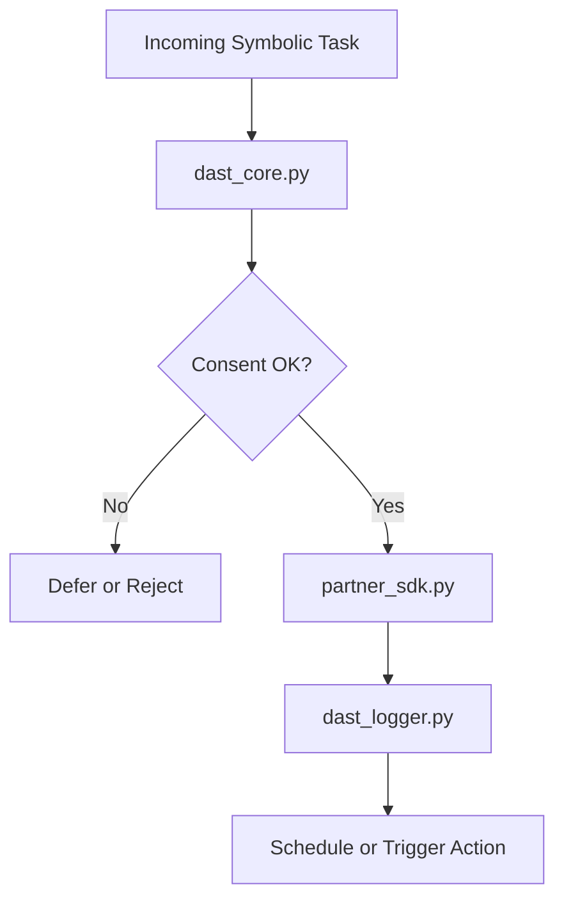

# 🔗 DAST · Dynamic Alignment & Symbolic Tasking

DAST is the modular alignment interface within LUCΛS that enables task docking, partner compatibility scoring, and symbolic routing of real-time or dream-deferred message streams.

---

## 🧠 Module Purpose

DAST handles symbolic task scheduling and interaction between LUCΛS and external entities (humans, agents, apps). It ensures all interactions align with user tier, emotional load, and partner-specific capabilities.

---

## 📦 Module Components

| File | Description |
|------|-------------|
| `dast_core.py` | Main logic for docking symbolic tasks and partner commands |
| `dast_logger.py` | Logs all task requests, partner triggers, and override events |
| `partner_sdk.py` | Simulated or real connector for external services (e.g. Amazon, Spotify) |
| `schedule_manager.py` | (planned) symbolic task scheduler and delay logic |

---

## 🔐 Consent & Ethics

DAST respects the ethical boundaries enforced by NIAS and ABAS. It will refuse or defer interactions when:

- Consent is insufficient (tier too low)
- Emotional thresholds are too unstable (ABAS block)
- Partner SDK is flagged for conflict or unsafe state

---

## 🔄 Interaction Flow

---

## 🛠 Future Upgrades

- 🧠 Partner compatibility scoring (symbolic personality mesh)
- 🧭 External partner trust scoring system
- 🌀 Streamlit-based task dashboard
- 🔒 SDK override logic with quorum check

> “DAST aligns what is possible, with what is permitted — and what should be felt.”  
> — LUCΛS 🖤
