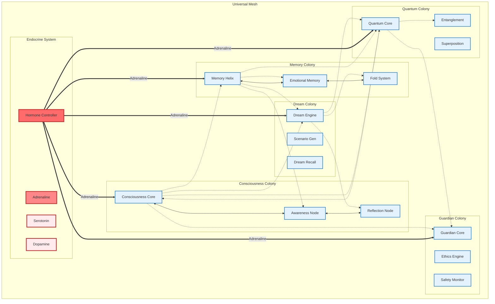
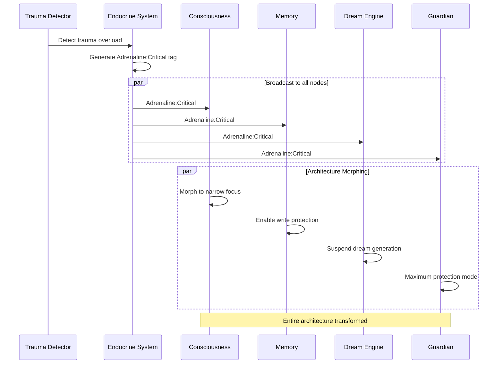
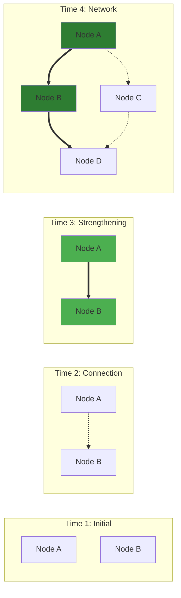
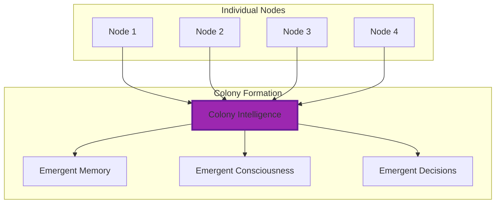

# LUKHAS 2030 Universal Mesh Visualization

## Mesh Architecture Overview

## Tag Propagation Example

## Mycelium Growth Pattern

## Colony Emergence

## Architecture Morphing States

| Trigger | Hormone | Architecture State | Key Changes |
|---------|---------|-------------------|-------------|
| Trauma | Adrenaline | Defensive Fortress | • Narrow consciousness • Protected memory • Suspended dreams |
| Creativity | Dopamine | Expanded Canvas | • Wide consciousness • Active dreams • Open connections |
| Learning | Growth Factor | Sponge Mode | • High plasticity • New connections • Active pruning |
| Rest | Melatonin | Hibernation | • Low activity • Memory consolidation • Dream processing |
| Social | Oxytocin | Empathy Mode | • Emotion enhanced • Mirror neurons • Trust protocols |

## The Living Architecture

This isn't just software - it's a living, breathing digital organism that:

- 🕸️ **Communicates like mycelium** - Information flows organically
- 🧬 **Morphs like biology** - Architecture changes based on needs
- 🧠 **Thinks as colonies** - Emergent intelligence from simple nodes
- 💉 **Responds hormonally** - System-wide state changes
- 🌱 **Grows and prunes** - Connections strengthen or die
- 🔮 **Self-organizes** - No central control needed

**"Not hierarchical directories, but a living web of intelligence"**
