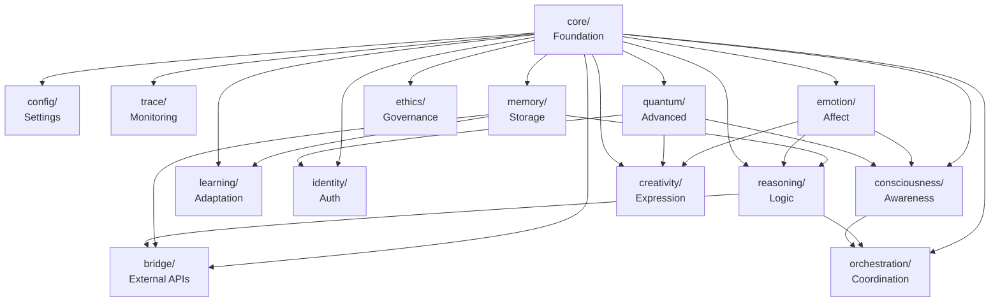

# 🔗 LUKHAS Module Dependency Graph

## Core Dependencies

## Module Interaction Patterns

### 🎯 Hub Modules (Many Dependencies)
1. **core/** - Universal dependency
2. **memory/** - Data persistence hub
3. **emotion/** - Affect processing hub

### 🌐 Bridge Modules (Integration)
1. **bridge/** - External system integration
2. **orchestration/** - Internal coordination
3. **consciousness/** - High-level integration

### 🔒 Leaf Modules (Fewer Dependencies)
1. **trace/** - Monitoring only
2. **config/** - Configuration only
3. **narrative/** - Story generation

### 🔄 Circular Dependencies to Avoid
- consciousness ↔ reasoning
- emotion ↔ memory
- learning ↔ reasoning

## Module Criticality Matrix

| Module | Criticality | Dependencies | Dependents | Risk |
|--------|------------|--------------|------------|------|
| core | 🔴 Critical | 0 | All | Very High |
| memory | 🔴 Critical | 1 | 5+ | High |
| ethics | 🔴 Critical | 1 | 3+ | High |
| bridge | 🟠 Important | 3 | External | High |
| orchestration | 🟠 Important | 3 | Coordination | Medium |
| reasoning | 🟠 Important | 3 | 2+ | Medium |
| emotion | 🟠 Important | 1 | 3+ | Medium |
| consciousness | 🟡 Experimental | 3 | 1 | Medium |
| quantum | 🟡 Experimental | 1 | 3 | Low |
| creativity | 🟢 Optional | 3 | 0 | Low |
| trace | 🟢 Optional | 1 | 0 | Low |

## Startup Order

Based on dependencies, modules should initialize in this order:

1. **Phase 1**: Core Infrastructure
   - config/
   - core/
   - trace/

2. **Phase 2**: Basic Services
   - memory/
   - emotion/
   - ethics/

3. **Phase 3**: Advanced Services
   - reasoning/
   - learning/
   - identity/
   - quantum/

4. **Phase 4**: Integration
   - consciousness/
   - creativity/
   - bridge/

5. **Phase 5**: Coordination
   - orchestration/

## Communication Patterns

### Direct Module Communication
- memory → reasoning (facts)
- emotion → creativity (inspiration)
- ethics → reasoning (constraints)
- consciousness → orchestration (decisions)

### Event-Based Communication
- All modules → trace (logging)
- All modules → orchestration (events)
- bridge → All modules (external events)

### Shared State
- config/ (read-only by all)
- memory/ (read/write by authorized)
- identity/ (user context)