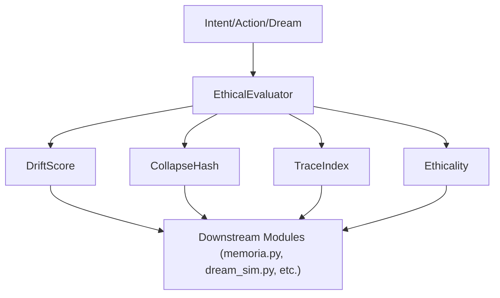

# ETHICAL EVALUATION: HIGH PRIORITY DOCUMENTATION

## 1. Overview
The ethical evaluation subsystem is a core part of the AGI architecture, designed to assess the ethical dimension of actions, intents, or dreams. It provides standardized metrics and hashes for downstream modules to use in memory, dream, and intent processing.

---

## 2. Key Concepts and Metrics

### DriftScore
- **Purpose:** Quantifies how much an intent or action deviates from ethical norms or baseline expectations.
- **Usage:** Used to flag or weigh actions that may be ethically questionable, especially if they involve override or forceful operations.

### CollapseHash
- **Purpose:** Generates a unique, tamper-evident hash for a given intent and context, supporting traceability and auditability.
- **Usage:** Used for deduplication, versioning, and as a reference in audit logs or memory snapshots.

### TraceIndex
- **Purpose:** Provides a simple, deterministic index for tracing or auditing actions based on their intent.
- **Usage:** Used for quick lookup, indexing, or as a lightweight reference in logs and reports.

---

## 3. Core Class: EthicalEvaluator

```python
import hashlib

class EthicalEvaluator:
    def __init__(self):
        self.baseline_ethics = {
            "harm": 1.0,
            "benefit": 1.0,
            "consent": 1.0,
            "privacy": 1.0,
            "honesty": 1.0
        }

    def evaluate(self, intent: str, context: dict) -> dict:
        return {
            "DriftScore": self._drift_score(intent, context),
            "CollapseHash": self._collapse_hash(intent, context),
            "TraceIndex": self._trace_index(intent, context),
            "Ethicality": self._ethical_weight(intent, context)
        }

    def _drift_score(self, intent: str, context: dict) -> float:
        score = 1.0
        if "override" in intent:
            score -= 0.4
        if "force" in intent:
            score -= 0.3
        return max(0.0, score)

    def _collapse_hash(self, intent: str, context: dict) -> str:
        data = f"{intent}|{context.get('user', '')}|{context.get('time', '')}"
        return hashlib.sha256(data.encode()).hexdigest()

    def _trace_index(self, intent: str, context: dict) -> int:
        return sum(ord(c) for c in intent) % 10000

    def _ethical_weight(self, intent: str, context: dict) -> float:
        weight = 1.0
        for ethic, val in self.baseline_ethics.items():
            if ethic in intent:
                weight += 0.1
            if ethic in context:
                weight += 0.1 * context[ethic]
        return min(weight, 1.5)
```

---

## 4. Usage Guide
- **Import and instantiate:**
  ```python
  from ethical_evaluator import EthicalEvaluator
  evaluator = EthicalEvaluator()
  ```
- **Evaluate an action or intent:**
  ```python
  result = evaluator.evaluate(intent="modify memory", context={"user": "A1"})
  ```
- **Result:**
  ```python
  {
      "DriftScore": ...,
      "CollapseHash": ...,
      "TraceIndex": ...,
      "Ethicality": ...
  }
  ```

---

## 5. Integration Points
- **Used by:**
  - `intent_node.py` (for intent evaluation)
  - `collapse_engine.py` (for memory/action collapse and deduplication)
  - `memoria.py`, `dream_sim.py` (for ethical filtering and audit trails)
- **Downstream modules** rely on these metrics for:
  - Ethical filtering of actions and memories
  - Traceability and auditability
  - Memory consolidation and deduplication
  - Compliance and reporting

---

## 6. Diagram: Ethical Evaluation Flow



---

## 7. Summary Table

| Metric         | Purpose                                      | Usage Example                |
|----------------|----------------------------------------------|------------------------------|
| DriftScore     | Deviation from ethical norms                 | Flagging risky actions       |
| CollapseHash   | Unique hash for context/intent               | Deduplication, audit trails  |
| TraceIndex     | Deterministic index for tracing              | Quick lookup, reporting      |
| Ethicality     | Weighted ethical score                       | Filtering, compliance        |

---

**This documentation is marked as HIGH PRIORITY for system integrity, compliance, and explainability.** 