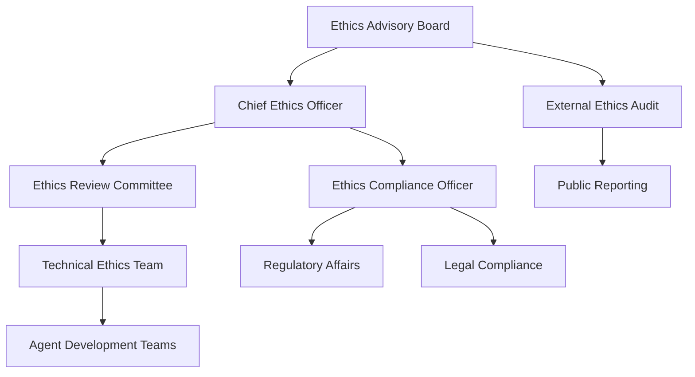

# Ethics Alignment and Responsible AI Development Section

## Ethical Framework for Multi-Agent AI Systems

### Core Ethical Principles

#### 1. Human Agency and Oversight
**Principle:** AI systems should support human decision-making and maintain meaningful human control.

**Implementation in LUKHAS:**
- Human oversight integration points at critical decision nodes
- Transparent agent reasoning with explainable outputs
- Human veto power for high-stakes decisions
- Clear escalation pathways for ethical concerns

**Validation Methods:**
- Human-in-the-loop testing protocols
- Decision audit trails with human review checkpoints
- User interface design for meaningful human control
- Regular ethics review board assessments

#### 2. Technical Robustness and Safety
**Principle:** AI systems must be reliable, secure, and perform safely under all conditions.

**Implementation in LUKHAS:**
- Redundant safety mechanisms across agent network
- Fail-safe defaults when agent consensus cannot be reached
- Continuous monitoring for system anomalies
- Automated safety protocol activation

**Validation Methods:**
- Adversarial testing across multiple attack vectors
- Safety stress testing under extreme conditions
- Formal verification of critical safety properties
- Independent security audits and penetration testing

#### 3. Privacy and Data Governance
**Principle:** Citizens should have full control over their data while enabling innovation.

**Implementation in LUKHAS:**
- Privacy-by-design in all agent communications
- Data minimization: agents only access necessary information
- Cryptographic privacy preservation techniques
- User consent management with granular control

**Validation Methods:**
- Privacy impact assessments for all data flows
- Regular compliance audits against GDPR requirements
- Cryptographic verification of privacy protections
- User control testing and validation

#### 4. Transparency and Explainability
**Principle:** AI decision-making processes should be understandable and auditable.

**Implementation in LUKHAS:**
- Multi-agent consensus explanations
- Decision provenance tracking across agent chain
- Natural language explanations of AI reasoning
- Visual decision flow representations

**Validation Methods:**
- Explainability testing with diverse user groups
- Comprehension assessments of AI explanations
- Decision audit trail completeness verification
- Transparency metric development and measurement

#### 5. Diversity, Non-discrimination, and Fairness
**Principle:** AI systems should be inclusive and avoid discriminatory outcomes.

**Implementation in LUKHAS:**
- Multi-agent bias detection and mitigation
- Diverse training data across all agents
- Fairness metrics monitoring and reporting
- Bias correction through agent consensus mechanisms

**Validation Methods:**
- Bias testing across protected demographic groups
- Fairness metrics evaluation and benchmarking
- Diverse stakeholder input in system design
- Regular algorithmic impact assessments

#### 6. Societal and Environmental Well-being
**Principle:** AI should benefit society and minimize environmental impact.

**Implementation in LUKHAS:**
- Efficient resource utilization through intelligent routing
- Carbon footprint monitoring and optimization
- Social impact assessment integration
- Sustainable computing practices

**Validation Methods:**
- Environmental impact measurement and reporting
- Social benefit assessment and quantification
- Stakeholder engagement and feedback collection
- Sustainability metrics tracking and optimization

### Multi-Agent Ethical Decision Framework

#### Consensus-Based Ethics Engine

```python
class EthicsConsensusEngine:
    def __init__(self):
        self.ethical_principles = [
            HumanAgencyPrinciple(),
            SafetyPrinciple(), 
            PrivacyPrinciple(),
            TransparencyPrinciple(),
            FairnessPrinciple(),
            SocietalBenefitPrinciple()
        ]
    
    async def evaluate_decision(self, proposed_action, context):
        """Evaluate proposed action against ethical principles"""
        principle_scores = []
        
        for principle in self.ethical_principles:
            score = await principle.evaluate(proposed_action, context)
            principle_scores.append(score)
        
        # Require consensus across all principles
        if min(principle_scores) < 0.7:  # 70% threshold
            return EthicsDecision(
                approved=False,
                concerns=self._identify_concerns(principle_scores),
                recommendations=self._generate_recommendations(proposed_action)
            )
        
        return EthicsDecision(approved=True, confidence=np.mean(principle_scores))
```

#### Ethical Agent Coordination

**Multi-Agent Ethics Protocol:**
1. **Proposal Phase**: Agent proposes action with ethical justification
2. **Review Phase**: Multiple agents independently assess ethical implications
3. **Consensus Phase**: Aggregate ethical assessments and identify concerns
4. **Resolution Phase**: Either approve action or propose ethical alternatives
5. **Monitoring Phase**: Continuous monitoring of actual outcomes vs. ethical predictions

### Bias Detection and Mitigation

#### Cross-Agent Bias Analysis

**Methodology:**
- Deploy identical tasks across different agents
- Compare outputs for systematic biases
- Identify and quantify bias patterns
- Implement correction mechanisms

**Bias Categories Monitored:**
- Demographic bias (age, gender, race, nationality)
- Cognitive bias (confirmation bias, availability heuristic)
- Cultural bias (Western-centric perspectives)
- Temporal bias (recency effects, outdated information)

#### Bias Mitigation Strategies

1. **Agent Diversity**: Utilize agents trained on diverse datasets
2. **Consensus Filtering**: Flag outputs where agents significantly disagree
3. **Bias Correction**: Apply post-processing bias correction algorithms
4. **Human Review**: Escalate high-bias-risk decisions to human oversight

### Stakeholder Engagement Framework

#### Ethics Advisory Board

**Composition:**
- Ethicists and moral philosophers
- Legal experts in AI and technology law
- Civil rights advocates and community representatives
- Industry experts and practitioners
- Academic researchers in AI ethics

**Responsibilities:**
- Review and approve ethical guidelines
- Assess ethical implications of new features
- Investigate ethical concerns and complaints
- Provide guidance on emerging ethical challenges

#### Community Feedback Integration

**Mechanisms:**
- Public ethics review periods for major updates
- Community input channels for ethical concerns
- Regular public reporting on ethics metrics
- Open-source ethics evaluation tools

### Compliance and Governance

#### Regulatory Alignment

**EU AI Act Compliance:**
- High-risk AI system classification and requirements
- Conformity assessment procedures
- CE marking and technical documentation
- Post-market monitoring and reporting

**GDPR Compliance:**
- Automated data protection impact assessments
- Privacy-by-design implementation verification
- Data subject rights automation
- Cross-border data transfer safeguards

#### Ethics Governance Structure



### Continuous Monitoring and Improvement

#### Ethics Metrics Dashboard

**Key Performance Indicators:**
- Bias detection rate and mitigation effectiveness
- Human oversight intervention frequency
- Transparency score from user assessments
- Ethical compliance audit results
- Community feedback sentiment analysis

#### Automated Ethics Monitoring

```python
class EthicsMonitor:
    def __init__(self):
        self.metrics_collector = EthicsMetricsCollector()
        self.alert_system = EthicsAlertSystem()
    
    async def monitor_agent_decision(self, decision_context):
        """Real-time ethics monitoring of agent decisions"""
        ethics_score = await self.evaluate_ethics(decision_context)
        
        if ethics_score < ETHICS_THRESHOLD:
            await self.alert_system.raise_ethics_concern(decision_context)
            await self.escalate_to_human_review(decision_context)
        
        await self.metrics_collector.record_ethics_assessment(
            decision_context, ethics_score
        )
```

### Research and Development Ethics

#### Ethical AI Research Practices

**Principles:**
- Open science and reproducible research
- Inclusive participation in research design
- Transparent reporting of limitations and risks
- Responsible disclosure of vulnerabilities

**Implementation:**
- Pre-registration of research protocols
- Open-source publication of research code
- Diverse research team composition
- Ethics review for all research activities

#### Innovation Ethics Framework

**Dual-Use Research Oversight:**
- Assessment of potential misuse applications
- Mitigation strategies for identified risks
- Collaboration with security experts
- Responsible publication and disclosure practices

### Training and Education

#### Ethics Training Program

**For Developers:**
- AI ethics fundamentals course
- Bias detection and mitigation techniques
- Responsible AI development practices
- Ethics-by-design methodologies

**For Users:**
- AI system limitations and appropriate use
- Privacy and data protection awareness
- Bias recognition and reporting
- Human oversight best practices

#### Continuous Ethics Education

- Regular ethics workshops and seminars
- Case study analysis and discussion
- Guest lectures from ethics experts
- Participation in ethics conferences and forums

### Accountability and Transparency

#### Public Transparency Reports

**Quarterly Ethics Reports:**
- Ethics metrics and performance indicators
- Bias detection and mitigation results
- Stakeholder feedback summary
- Regulatory compliance status

**Annual Ethics Assessment:**
- Comprehensive ethics system evaluation
- External audit findings and responses
- Ethics framework updates and improvements
- Future ethics roadmap and commitments

#### Accountability Mechanisms

- Clear responsibility assignment for ethics decisions
- Traceable decision-making processes
- Regular ethics performance reviews
- Corrective action protocols for ethics violations

### Future Ethics Considerations

#### Emerging Ethical Challenges

**AGI Development Ethics:**
- Preparation for artificial general intelligence
- Long-term safety and alignment research
- Global coordination on AGI governance
- Existential risk assessment and mitigation

**Human-AI Collaboration Ethics:**
- Evolving human-AI relationship dynamics
- Workplace ethics and job displacement
- Cognitive enhancement and augmentation
- Human identity and agency preservation

#### Adaptive Ethics Framework

- Regular review and update of ethical principles
- Integration of new ethical research findings
- Adaptation to evolving social values
- Proactive identification of future ethical challenges

---

This ethics alignment section demonstrates our commitment to responsible AI development and provides a comprehensive framework for ensuring that LUKHAS operates in accordance with the highest ethical standards and regulatory requirements.
