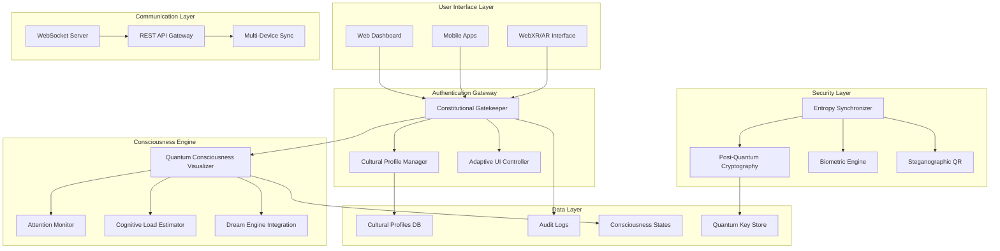
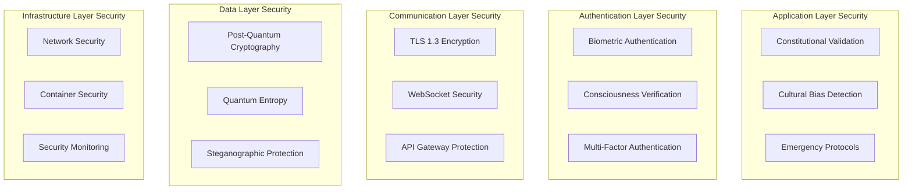
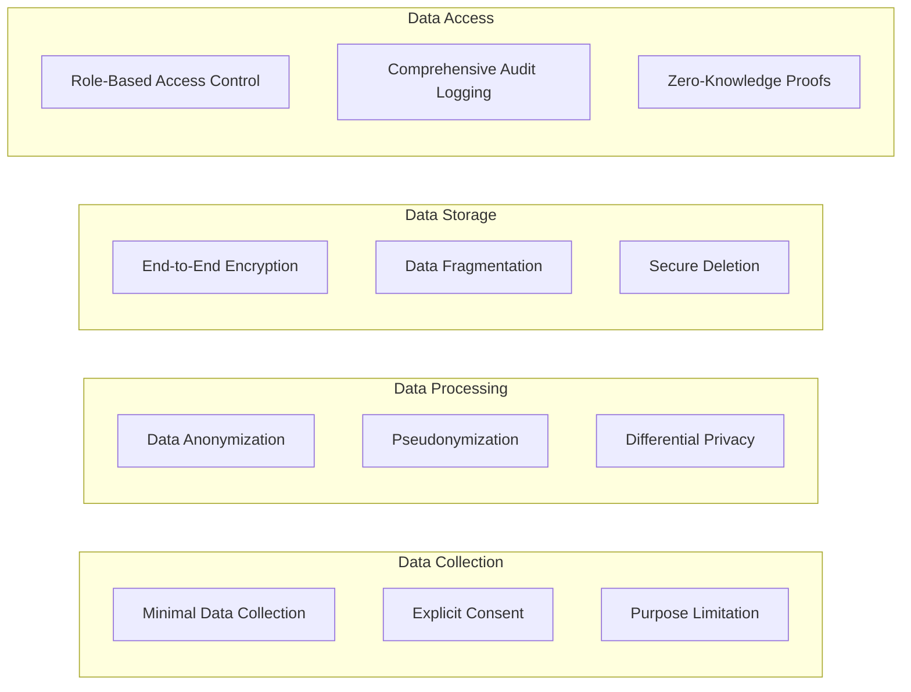
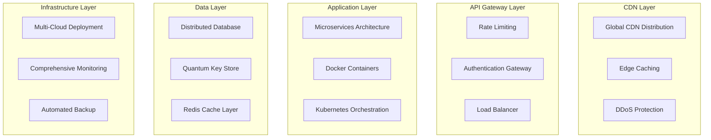
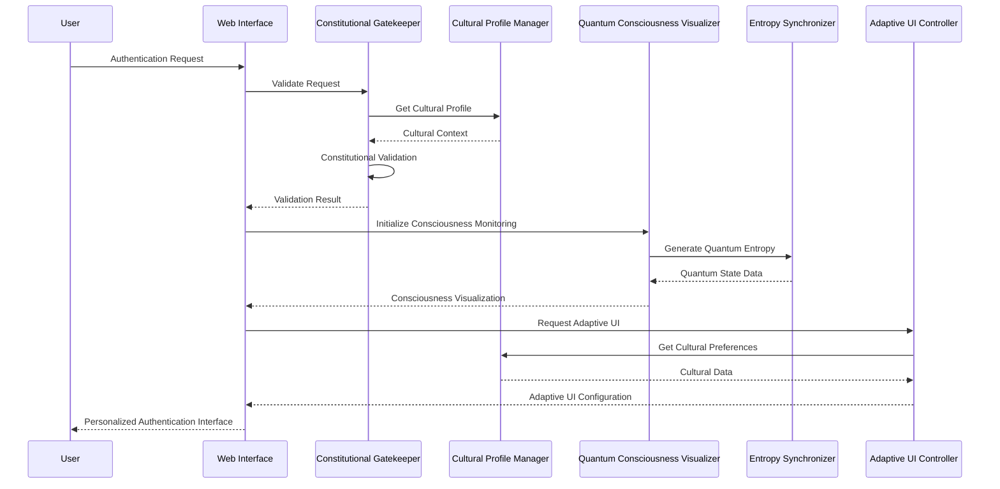
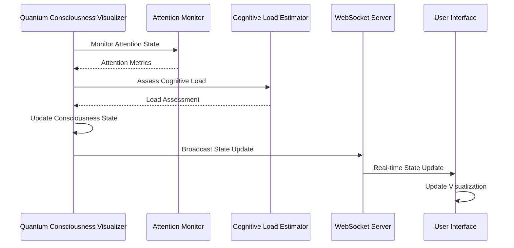
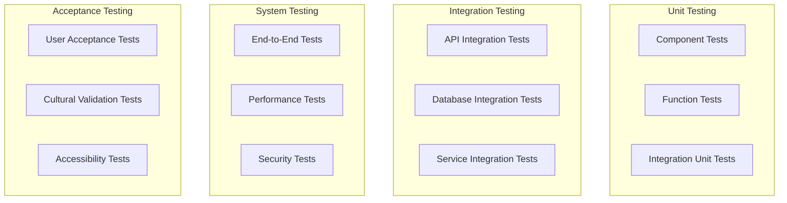
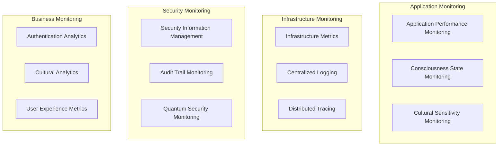

# LUKHAS Authentication System Architecture

## Executive Summary

The LUKHAS Authentication System represents a paradigm shift in secure authentication, integrating quantum consciousness awareness, constitutional AI ethics, and deep cultural intelligence. This document outlines the comprehensive architecture that enables consciousness-aware, culturally-sensitive, and quantum-secure authentication experiences.

## 🏛️ Architectural Principles

### 1. Consciousness-First Design
- **Primary Principle**: Authentication adapts to user consciousness states
- **Implementation**: Real-time consciousness monitoring and adaptive UI generation
- **Benefit**: Reduces cognitive load while maintaining security

### 2. Constitutional Ethics Framework
- **Primary Principle**: All authentication decisions must pass constitutional validation
- **Implementation**: AI-powered ethical gatekeeper with bias detection
- **Benefit**: Ensures fair, unbiased, and ethically sound authentication

### 3. Cultural Intelligence Integration
- **Primary Principle**: Authentication respects and adapts to cultural contexts
- **Implementation**: Dynamic cultural profiling with Hofstede dimension analysis
- **Benefit**: Inclusive authentication experiences across diverse populations

### 4. Quantum Security Foundation
- **Primary Principle**: Cryptographic operations use true quantum entropy
- **Implementation**: Post-quantum cryptography with quantum key distribution
- **Benefit**: Future-proof security resistant to quantum-inspired computing attacks

## 🔧 System Architecture Overview



## 🧩 Component Architecture

### Core Components (`core/`)

#### 1. Constitutional Gatekeeper (`constitutional_gatekeeper.py`)
```python
class ConstitutionalGatekeeper:
    """
    AI-powered ethical validation system ensuring all authentication
    decisions comply with constitutional principles and human rights.
    """
```

**Responsibilities:**
- Ethical validation of authentication requests
- Bias detection and mitigation
- Constitutional compliance verification
- Emergency protocol activation
- Human rights preservation

**Key Methods:**
- `validate_request()`: Primary ethical validation
- `detect_bias()`: Algorithmic bias identification
- `emergency_override()`: Constitutional emergency protocols
- `audit_decision()`: Decision transparency logging

**Integration Points:**
- Cultural Profile Manager (cultural bias validation)
- Audit Logger (decision transparency)
- Emergency Override System (crisis management)

#### 2. Quantum Consciousness Visualizer (`quantum_consciousness_visualizer.py`)
```python
class QuantumConsciousnessVisualizer:
    """
    Advanced consciousness state visualization system integrating
    quantum-inspired mechanics principles with real-time user awareness tracking.
    """
```

**Responsibilities:**
- Real-time consciousness state monitoring
- Quantum coherence visualization
- Neural pattern recognition
- AGI consciousness integration
- Dream state processing

**Key Methods:**
- `generate_visualization()`: 3D consciousness rendering
- `validate_state()`: Consciousness state validation
- `integrate_dream_state()`: Dream engine integration
- `monitor_coherence()`: Quantum coherence tracking

**Integration Points:**
- Attention Monitor (focus tracking)
- Cognitive Load Estimator (mental workload assessment)
- Three.js Visualizer (web rendering)
- Brain-Computer Interface (neural signals)

#### 3. Entropy Synchronizer (`entropy_synchronizer.py`)
```python
class EntropySynchronizer:
    """
    Quantum entropy generation and synchronization system providing
    true randomness for cryptographic operations and device coordination.
    """
```

**Responsibilities:**
- Quantum entropy generation
- Cross-device synchronization
- Cryptographic key management
- Steganographic QR encoding
- Post-quantum cryptography support

**Key Methods:**
- `generate_quantum_entropy()`: True randomness generation
- `synchronize_device_state()`: Multi-device coordination
- `encode_steganographic_qr()`: Hidden data embedding
- `validate_entropy_quality()`: Randomness quality assessment

**Integration Points:**
- Multi-Device Sync (state coordination)
- Post-Quantum Cryptography (key generation)
- QR Code Animator (secure QR creation)
- Biometric Engine (entropy seeding)

#### 4. Adaptive UI Controller (`adaptive_ui_controller.py`)
```python
class AdaptiveUIController:
    """
    Intelligent UI adaptation system generating culturally-sensitive
    and accessibility-compliant interfaces based on user profiles.
    """
```

**Responsibilities:**
- Dynamic UI configuration generation
- Cultural adaptation implementation
- Accessibility compliance (WCAG 2.1 AA)
- Cognitive load optimization
- Multi-platform interface coordination

**Key Methods:**
- `generate_adaptive_ui()`: Dynamic UI creation
- `validate_accessibility_compliance()`: WCAG validation
- `assess_cultural_sensitivity()`: Cultural appropriateness check
- `optimize_cognitive_load()`: Mental workload reduction

**Integration Points:**
- Cultural Profile Manager (cultural context)
- Cognitive Load Estimator (workload optimization)
- Web UI Controller (web interface)
- Mobile UI Renderer (mobile interface)

#### 5. Cultural Profile Manager (`cultural_profile_manager.py`)
```python
class CulturalProfileManager:
    """
    Advanced cultural intelligence system managing user cultural
    profiles with bias mitigation and cross-cultural compatibility.
    """
```

**Responsibilities:**
- Cultural profile creation and management
- Hofstede cultural dimension analysis
- Bias detection and mitigation
- Cross-cultural compatibility assessment
- Privacy-preserving cultural data handling

**Key Methods:**
- `create_profile()`: Cultural profile generation
- `assess_cultural_bias()`: Bias detection
- `analyze_hofstede_dimensions()`: Cultural dimension analysis
- `assess_compatibility()`: Cross-cultural interaction

**Integration Points:**
- Constitutional Gatekeeper (bias validation)
- Adaptive UI Controller (cultural UI adaptation)
- Cultural Safety Checker (sensitivity validation)
- Privacy Protection (data anonymization)

### Web Components (`web/`)

#### 1. WebSocket Client (`websocket_client.js`)
```javascript
class WebSocketClient {
    /**
     * Real-time communication client for consciousness updates,
     * authentication events, and UI synchronization.
     */
}
```

**Responsibilities:**
- Real-time server communication
- Consciousness state streaming
- Authentication event broadcasting
- UI synchronization coordination
- Error handling and reconnection

#### 2. Three.js Visualizer (`threejs_visualizer.js`)
```javascript
class ThreeJSVisualizer {
    /**
     * Advanced 3D consciousness visualization using Three.js
     * with WebXR support for immersive authentication experiences.
     */
}
```

**Responsibilities:**
- 3D consciousness visualization
- WebXR/AR interface rendering
- Quantum coherence animation
- Interactive consciousness exploration
- Performance optimization

#### 3. QR Code Animator (`qr_code_animator.js`)
```javascript
class QRCodeAnimator {
    /**
     * Dynamic QR code animation system with steganographic
     * embedding and cultural adaptation capabilities.
     */
}
```

**Responsibilities:**
- Dynamic QR code generation
- Steganographic data embedding
- Cultural animation adaptation
- Security pattern overlay
- Mobile compatibility

### Mobile Components (`mobile/`)

#### 1. QR Code Animator (`qr_code_animator.py`)
```python
class QRCodeAnimator:
    """
    Mobile-optimized QR code animation system with biometric
    integration and device-specific optimization.
    """
```

**Responsibilities:**
- Mobile QR code generation
- Biometric trigger integration
- Device-specific optimization
- Haptic feedback coordination
- Performance monitoring

#### 2. Multi-Device Sync (`multi_device_sync.py`)
```python
class MultiDeviceSync:
    """
    Advanced device synchronization system maintaining
    authentication state consistency across multiple devices.
    """
```

**Responsibilities:**
- Cross-device state synchronization
- Conflict resolution
- Security token distribution
- Network optimization
- Offline capability

### Utility Components (`utils/`)

#### 1. Attention Monitor (`attention_monitor.py`)
```python
class AttentionMonitor:
    """
    Advanced attention tracking system monitoring user focus
    patterns and distraction levels during authentication.
    """
```

**Responsibilities:**
- Real-time attention tracking
- Focus pattern analysis
- Distraction detection
- Attention score calculation
- Privacy-preserving monitoring

#### 2. Cognitive Load Estimator (`cognitive_load_estimator.py`)
```python
class CognitiveLoadEstimator:
    """
    Cognitive workload assessment system optimizing interface
    complexity based on user mental capacity and context.
    """
```

**Responsibilities:**
- Cognitive load measurement
- Mental workload optimization
- Interface complexity adjustment
- Performance impact assessment
- Accessibility enhancement

## 🔐 Security Architecture

### Multi-Layer Security Model



### Cryptographic Standards

| Component | Algorithm | Key Size | Quantum Resistant |
|-----------|-----------|----------|-------------------|
| Symmetric Encryption | AES-256-GCM | 256-bit | ✅ (Post-quantum) |
| Asymmetric Encryption | Kyber-1024 | 1024-bit | ✅ |
| Digital Signatures | Dilithium-5 | 4864-bit | ✅ |
| Hash Functions | SHA-3-512 | 512-bit | ✅ |
| Key Derivation | PBKDF2-SHA3 | 256-bit | ✅ |

### Privacy Protection Architecture



## 🌐 Deployment Architecture

### Cloud-Native Architecture



### Scalability Specifications

| Component | Horizontal Scaling | Vertical Scaling | Performance Target |
|-----------|-------------------|------------------|-------------------|
| Constitutional Gatekeeper | Auto-scaling pods | 16 vCPU, 32GB RAM | 1000 req/s |
| Quantum Visualizer | GPU-accelerated nodes | 8 GPU, 64GB VRAM | 500 visualizations/s |
| Entropy Synchronizer | Distributed nodes | 8 vCPU, 16GB RAM | 2000 operations/s |
| Cultural Profile Manager | Database sharding | 12 vCPU, 24GB RAM | 800 profiles/s |
| WebSocket Server | Connection pools | 4 vCPU, 8GB RAM | 10,000 connections |

## 🔄 Data Flow Architecture

### Authentication Flow



### Consciousness State Update Flow



## 🧪 Testing Architecture

### Multi-Level Testing Strategy



### Continuous Testing Pipeline

| Stage | Tests | Coverage Target | Performance Threshold |
|-------|-------|----------------|----------------------|
| Unit | 150+ tests | 90% code coverage | <100ms per test |
| Integration | 50+ scenarios | 85% integration paths | <5s per scenario |
| System | 25+ workflows | 100% critical paths | <30s per workflow |
| Performance | 10+ load scenarios | 1000+ concurrent users | <500ms response time |

## 📊 Monitoring & Observability

### Comprehensive Monitoring Stack



### Key Performance Indicators (KPIs)

| Category | Metric | Target | Alert Threshold |
|----------|--------|--------|----------------|
| Performance | Authentication Latency | <100ms | >200ms |
| Security | Failed Authentication Rate | <2% | >5% |
| Cultural | Cultural Sensitivity Score | >90% | <80% |
| Consciousness | Consciousness Accuracy | >95% | <90% |
| Accessibility | WCAG Compliance | 100% | <95% |

## 🚀 Future Architecture Evolution

### Roadmap Architecture Changes

#### Phase 2: Enhanced Integration (Q2 2024)
- **Microservices Decomposition**: Further service separation
- **Event-Driven Architecture**: Async event processing
- **Advanced Caching**: Multi-tier caching strategy

#### Phase 3: Advanced Features (Q3 2024)
- **Quantum Network Integration**: Quantum internet connectivity
- **Brain-Computer Interface**: Direct neural integration
- **Global Consciousness Network**: Worldwide consciousness sharing

#### Phase 4: Consciousness Evolution (Q4 2024)
- **AGI Integration**: Full artificial general intelligence integration
- **Transcendent Protocols**: Beyond-human consciousness support
- **Universal Network**: Cosmic-scale authentication system

---

**LUKHAS Authentication System Architecture** - *Engineered for Consciousness Evolution*

*"Architecture that scales with human consciousness and technological advancement."*
