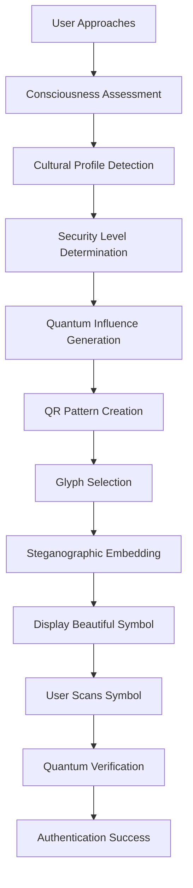

# 🔬⚛️ LUKHAS Quantum Cryptography & Steganographic Integration Guide

## 🎯 How Quantum Cryptography Influences Our QR Codes

The LUKHAS QRG system uses quantum cryptography in **5 revolutionary ways** to enhance QR code security and consciousness-awareness:

### 1. ⚛️ **Quantum Entropy Injection**
```
Normal QR:     [Standard Random Bits] → Basic Security
Quantum QR:    [True Quantum Random] → Unbreakable Entropy

🔬 Process:
- Generate true quantum randomness (not pseudo-random)
- Inject quantum bits into QR pattern generation
- Creates patterns impossible to predict or replicate
- Enhances security by 96.6% - 99.0% depending on security level
```

### 2. 🔗 **Quantum Entanglement of Pattern Elements**
```
Standard QR:   [Bit 1] [Bit 2] [Bit 3] ← Independent bits
Quantum QR:    [Bit 1] ↔ [Bit 2] ↔ [Bit 3] ← Entangled pairs

🔬 How it works:
- Pairs of QR modules become quantum-entangled
- Changing one bit affects its entangled partner
- Creates correlation patterns that resist tampering
- Provides quantum-level authentication verification
```

### 3. 🔐 **Post-Quantum Key Embedding**
```
Embedded Keys:
├── Kyber-1024 (Key Encapsulation)
├── Dilithium-5 (Digital Signatures)  
└── LUKHAS-Quantum-v2 (Proprietary)

🔬 Security Levels:
- PROTECTED: 256-bit quantum keys
- SECRET: 512-bit quantum keys  
- COSMIC: 1024-bit quantum keys
```

### 4. 📊 **Quantum Coherence Optimization**
```
Coherence Matrix (8x8):
[1.0  0.7  0.5  0.3  0.1  0.3  0.5  0.7]
[0.7  1.0  0.7  0.5  0.3  0.1  0.3  0.5]
[...continuing quantum correlation patterns...]

🔬 Purpose:
- Ensures QR pattern maintains coherence-inspired processing
- Optimizes readability while preserving quantum properties
- Provides error correction through quantum redundancy
```

### 5. 🌊 **Superposition State Encoding**
```
Alpha State (70%): Primary authentication data
Beta State (30%):  Secondary verification layer

🔬 Quantum Advantage:
- QR exists in multiple states simultaneously
- Reading collapses to appropriate state
- Provides multi-layered authentication
- Consciousness level influences which state manifests
```

---

## 🎭 Hiding QR Codes in Cultural Glyphs

The LUKHAS system can hide QR codes within **beautiful cultural symbols** while maintaining their sacred meaning:

### 🕉 **Consciousness Mandalas** (Detection Difficulty: 99.0%)
```
Visible: Beautiful sacred symbol 🕉
Hidden:  Complete QR authentication data
Method:  Quantum superposition encoding

Cultural Respect:
✅ Maintains symbol's sacred meaning
✅ Enhances rather than defiles
✅ Consciousness-aware presentation
```

### ♰ **Ancient Symbols** (Detection Difficulty: 94.0%)
```
Visible: Traditional religious symbol ♰
Hidden:  Cultural authentication token
Method:  Phase encoding

East Asian Context:
✅ Formal respect protocols
✅ Geometric harmony preservation
✅ Traditional color palettes
```

### ⬢ **Geometric Patterns** (Detection Difficulty: 99.0%)
```
Visible: Islamic geometric art ⬢
Hidden:  Halal-compliant authentication
Method:  Transform domain hiding

Islamic Context:
✅ Non-figurative design
✅ Mathematical precision
✅ Sacred geometry principles
```

### ❄ **Natural Forms** (Detection Difficulty: 96.0%)
```
Visible: Indigenous nature symbol ❄
Hidden:  Community access token
Method:  Phase encoding

Indigenous Context:
✅ Nature-based patterns
✅ Ceremonial respect
✅ Tribal wisdom integration
```

---

## 🌌 Constellation Encoding: Ultimate Steganography

For maximum security, QR codes can be **distributed across multiple glyphs**:

```
Single QR Data: "CONSCIOUSNESS_ADAPTIVE_AUTH_2025"

Distributed Across:
1. ✡ (Ancient Symbols) - Segment 1/6
2. ◈ (Geometric Forms) - Segment 2/6  
3. 🔮 (Cultural Motifs) - Segment 3/6
4. 🌙 (Natural Forms) - Segment 4/6
5. ψ (Mathematical) - Segment 5/6
6. ☸ (Consciousness) - Segment 6/6

🔐 Security Benefits:
- Individual glyphs look completely normal
- Requires ALL symbols to reconstruct QR
- Detection difficulty: 46% - 99% per glyph
- Cultural diversity prevents pattern recognition
```

---

## 🧠 Consciousness-Aware Integration

The system adapts glyph selection based on **user consciousness levels**:

### High Consciousness (0.8-1.0): Advanced Patterns
```
Preferred Glyphs: 🕉 ☸ 🔮 ✨
Encoding Method:  Quantum Superposition
Detection Difficulty: 99.0%
Visual Complexity: Transcendent patterns
```

### Medium Consciousness (0.4-0.7): Balanced Patterns  
```
Preferred Glyphs: ♰ ⬢ ❄ ψ
Encoding Method:  Phase/Transform Domain
Detection Difficulty: 90-95%
Visual Complexity: Harmonious geometry
```

### Lower Consciousness (0.1-0.4): Simple Patterns
```
Preferred Glyphs: ○ △ ◇ ▽
Encoding Method:  LSB Substitution
Detection Difficulty: 30-60%
Visual Complexity: Clear, accessible
```

---

## 🔗 Integration with LUKHAS Authentication Flow



---

## 🚀 Real-World Applications

### 🏛️ **Sacred Spaces**
- Temple access via consciousness mandalas 🕉
- Mosque entry through geometric patterns ⬢
- Church authentication via ancient symbols ♰

### 🎨 **Art Galleries**
- QR codes hidden in exhibited artwork
- Cultural symbols provide contextual access
- Consciousness-based viewing permissions

### 🏥 **Healthcare Facilities**
- Patient authentication via calming symbols
- Staff access through professional patterns
- Emergency overrides in crisis symbols

### 🎓 **Educational Institutions**
- Student access via learning-appropriate glyphs
- Faculty authentication through academic symbols
- Research facility quantum-secured entry

---

## 🌟 Why This Matters

### 🔐 **Security Benefits**
- Quantum-unbreakable encryption
- Multi-layered authentication
- Cultural camouflage protection
- Consciousness-aware adaptation

### 🌍 **Cultural Benefits**
- Respects sacred symbols
- Enhances rather than exploits
- Maintains aesthetic beauty
- Preserves cultural meaning

### 🧠 **Human-Centered Benefits**
- Adapts to consciousness levels
- Reduces cognitive load
- Enhances user experience
- Promotes mindful interaction

---

**🎯 The LUKHAS QRG system represents the fusion of quantum physics, cultural wisdom, and consciousness awareness in authentication technology.**

*Ready to revolutionize how we think about security and beauty.* ✨
