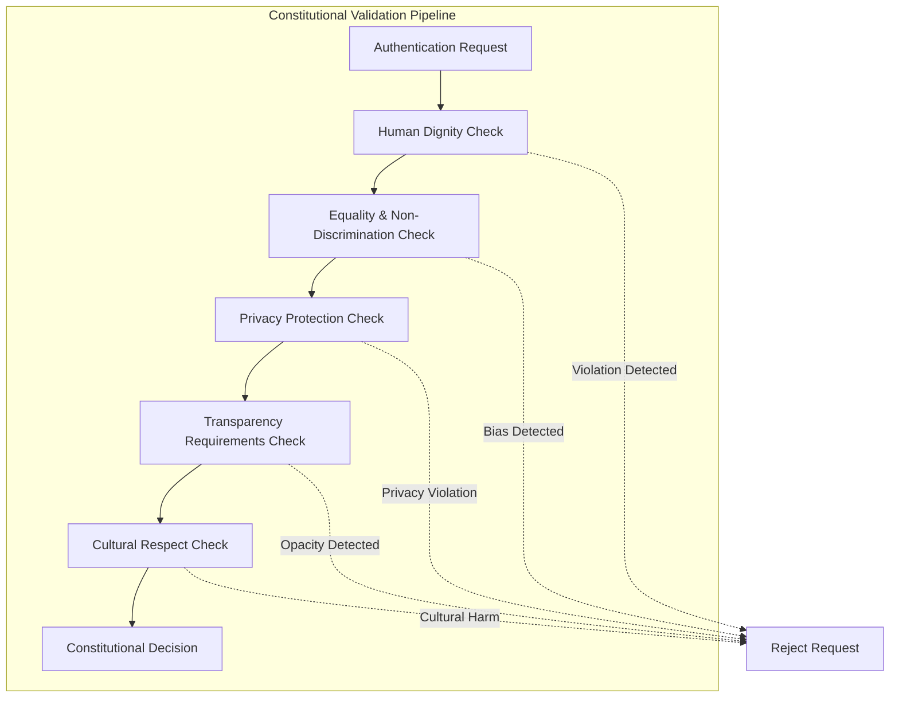

# Constitutional AI Guidelines for LUKHAS Authentication System

## 🏛️ Foundational Principles

The LUKHAS Authentication System operates under a comprehensive constitutional framework that ensures all authentication decisions, AI behaviors, and system operations adhere to fundamental human rights, ethical principles, and democratic values.

## 📜 Core Constitutional Tenets

### 1. Human Dignity & Autonomy
**Principle**: Every human possesses inherent dignity and the right to autonomous decision-making.

**Implementation**:
- All authentication processes must respect user agency and choice
- Users maintain control over their consciousness data and cultural profiles
- No authentication decision shall dehumanize or diminish individual worth
- Emergency overrides must preserve human dignity even in crisis situations

**Validation Criteria**:
- User consent is explicit and informed for all data collection
- Users can modify or delete their profiles at any time
- Authentication interfaces respect individual cognitive capabilities
- Cultural adaptations enhance rather than stereotype individuals

### 2. Equality & Non-Discrimination
**Principle**: All humans deserve equal treatment regardless of background, culture, ability, or consciousness state.

**Implementation**:
- Algorithmic bias detection and mitigation in all authentication decisions
- Cultural adaptations that celebrate rather than discriminate
- Accessibility features that ensure equal access for all abilities
- Consciousness state recognition that doesn't privilege certain states over others

**Validation Criteria**:
- Bias assessment scores below 0.2 threshold for all authentication flows
- WCAG 2.1 AA compliance for accessibility
- Cultural sensitivity scores above 0.9 for all cultural adaptations
- Equal authentication success rates across demographic groups

### 3. Privacy & Data Protection
**Principle**: Personal data, consciousness states, and cultural information are fundamental to individual identity and must be protected.

**Implementation**:
- End-to-end encryption for all consciousness and cultural data
- Minimal data collection principles (collect only what's necessary)
- Data anonymization and pseudonymization where possible
- User control over data sharing and deletion

**Validation Criteria**:
- Zero-knowledge proofs for authentication where possible
- Data retention policies that automatically delete unnecessary data
- User data portability and deletion rights fully implemented
- Regular security audits and penetration testing

### 4. Transparency & Accountability
**Principle**: Users have the right to understand how authentication decisions are made and to hold the system accountable.

**Implementation**:
- Explainable AI decisions with clear reasoning provided to users
- Comprehensive audit trails for all authentication events
- Regular algorithmic audits for bias and fairness
- Public reporting on system performance and ethical compliance

**Validation Criteria**:
- Decision explanations available for all authentication outcomes
- Audit logs immutable and accessible for review
- Quarterly ethics and bias assessment reports published
- User feedback mechanisms for reporting ethical concerns

### 5. Cultural Respect & Inclusion
**Principle**: Cultural diversity is a fundamental human right that must be celebrated and preserved.

**Implementation**:
- Cultural profile creation that avoids stereotyping
- UI adaptations that respect cultural values and communication styles
- Cross-cultural compatibility assessments that promote understanding
- Cultural safety measures that prevent cultural harm

**Validation Criteria**:
- Cultural profiles reviewed by cultural experts from respective communities
- UI adaptations tested with members of target cultural groups
- Regular consultation with cultural anthropologists and community leaders
- Cultural safety incident response protocols in place

## ⚖️ Constitutional Decision Framework

### Decision Validation Process



### Constitutional Scoring System

Each authentication request receives constitutional validation scores:

| Constitutional Principle | Weight | Pass Threshold | Validation Method |
|-------------------------|--------|----------------|------------------|
| Human Dignity | 25% | >0.95 | Dignity impact assessment |
| Equality | 25% | >0.90 | Bias detection algorithms |
| Privacy | 20% | >0.95 | Privacy impact analysis |
| Transparency | 15% | >0.85 | Explainability metrics |
| Cultural Respect | 15% | >0.90 | Cultural sensitivity analysis |

**Overall Constitutional Compliance**: Weighted average must exceed 0.92

## 🛡️ Ethical AI Safeguards

### Bias Prevention & Mitigation

#### Algorithmic Bias Detection
```python
class AlgorithmicBiasDetector:
    """
    Comprehensive bias detection system monitoring for:
    - Demographic bias (age, gender, ethnicity, etc.)
    - Cultural bias (cultural background discrimination)
    - Cognitive bias (consciousness state discrimination)
    - Accessibility bias (ability-based discrimination)
    """
    
    def detect_bias(self, authentication_data, decision_outcome):
        bias_indicators = {
            'demographic_bias': self.assess_demographic_fairness(authentication_data),
            'cultural_bias': self.assess_cultural_fairness(authentication_data),
            'cognitive_bias': self.assess_consciousness_fairness(authentication_data),
            'accessibility_bias': self.assess_accessibility_fairness(authentication_data)
        }
        return bias_indicators
```

#### Bias Mitigation Strategies
1. **Pre-Processing**: Remove biased features from input data
2. **In-Processing**: Use fairness constraints during model training
3. **Post-Processing**: Adjust outputs to ensure fair outcomes
4. **Continuous Monitoring**: Real-time bias detection and correction

### Constitutional Override Protocols

#### Emergency Constitutional Protocols
When constitutional violations are detected:

1. **Immediate Halt**: Stop the violating process immediately
2. **Constitutional Review**: Route to constitutional review board
3. **User Notification**: Inform user of constitutional protection activation
4. **Alternative Path**: Provide constitutional-compliant alternative
5. **Incident Documentation**: Log constitutional violation for review

#### Constitutional Review Board
- **Composition**: Ethics experts, cultural representatives, accessibility advocates
- **Authority**: Override system decisions that violate constitutional principles
- **Process**: 24-hour review cycle for constitutional violations
- **Appeal**: Users can appeal to constitutional review board

## 🌍 Cultural Constitutional Frameworks

### Cultural Rights Protection

#### Indigenous Rights
- **Recognition**: Acknowledge indigenous cultural authentication practices
- **Sovereignty**: Respect tribal sovereignty in authentication protocols
- **Sacred Knowledge**: Protect culturally sacred information from exposure
- **Self-Determination**: Enable indigenous communities to control their cultural data

#### Minority Rights Protection
- **Cultural Minority Recognition**: Protect authentication rights of cultural minorities
- **Language Accessibility**: Provide authentication in minority languages
- **Cultural Practice Accommodation**: Accommodate unique cultural practices
- **Anti-Assimilation**: Prevent forced cultural assimilation through authentication

#### Religious Freedom
- **Religious Accommodation**: Accommodate religious practices in authentication
- **Sacred Time Respect**: Respect religious observances and sacred times
- **Religious Privacy**: Protect religious information from unauthorized access
- **Interfaith Respect**: Ensure respectful treatment across all religious traditions

### Cultural Constitutional Validation

```python
class CulturalConstitutionalValidator:
    """
    Validates authentication decisions against cultural constitutional principles
    """
    
    def validate_cultural_decision(self, cultural_profile, authentication_decision):
        validations = {
            'cultural_sovereignty': self.check_cultural_sovereignty(cultural_profile),
            'cultural_dignity': self.assess_cultural_dignity_impact(authentication_decision),
            'cultural_autonomy': self.verify_cultural_autonomy_preservation(cultural_profile),
            'cultural_safety': self.evaluate_cultural_safety(authentication_decision)
        }
        
        constitutional_score = self.calculate_cultural_constitutional_score(validations)
        return {
            'constitutionally_valid': constitutional_score > 0.90,
            'score': constitutional_score,
            'violations': self.identify_constitutional_violations(validations)
        }
```

## 🔬 Consciousness Constitutional Rights

### Consciousness Dignity Principles

#### Consciousness Autonomy
- **Consciousness Sovereignty**: Individuals control their consciousness data
- **State Privacy**: Right to keep consciousness states private
- **Consciousness Diversity**: Recognition of different consciousness states as valid
- **Evolution Rights**: Right to consciousness development and evolution

#### Consciousness Equality
- **State Non-Discrimination**: No discrimination based on consciousness state
- **Cognitive Equality**: Equal treatment regardless of cognitive capacity
- **Consciousness Form Recognition**: Recognition of diverse consciousness forms
- **Neurodiversity Respect**: Respect for neurological diversity

#### Consciousness Protection
- **Mental Privacy**: Protection of mental states from unauthorized access
- **Consciousness Integrity**: Protection from consciousness manipulation
- **Cognitive Liberty**: Freedom to modify one's own consciousness
- **Mental Self-Determination**: Right to consciousness self-determination

### Consciousness Constitutional Framework

```python
class ConsciousnessConstitutionalFramework:
    """
    Constitutional framework specifically for consciousness-related rights
    """
    
    CONSCIOUSNESS_RIGHTS = {
        'privacy': 'Right to consciousness privacy',
        'autonomy': 'Right to consciousness autonomy', 
        'dignity': 'Right to consciousness dignity',
        'equality': 'Right to consciousness equality',
        'development': 'Right to consciousness development'
    }
    
    def validate_consciousness_decision(self, consciousness_data, decision):
        return {
            'privacy_protected': self.verify_consciousness_privacy(consciousness_data),
            'autonomy_preserved': self.check_consciousness_autonomy(decision),
            'dignity_maintained': self.assess_consciousness_dignity(decision),
            'equality_ensured': self.verify_consciousness_equality(decision),
            'development_supported': self.check_consciousness_development_support(decision)
        }
```

## 📋 Constitutional Compliance Monitoring

### Continuous Constitutional Monitoring

#### Real-Time Constitutional Validation
- **Decision Point Validation**: Constitutional check at every authentication decision
- **Continuous Bias Monitoring**: Real-time bias detection across all operations
- **Cultural Safety Monitoring**: Ongoing cultural impact assessment
- **Consciousness Rights Monitoring**: Continuous consciousness rights protection

#### Constitutional Audit System
```python
class ConstitutionalAuditSystem:
    """
    Comprehensive audit system for constitutional compliance monitoring
    """
    
    def perform_constitutional_audit(self):
        audit_results = {
            'human_dignity_compliance': self.audit_human_dignity_protection(),
            'equality_compliance': self.audit_equality_enforcement(),
            'privacy_compliance': self.audit_privacy_protection(),
            'transparency_compliance': self.audit_transparency_provision(),
            'cultural_compliance': self.audit_cultural_respect(),
            'consciousness_compliance': self.audit_consciousness_rights()
        }
        
        overall_compliance = self.calculate_overall_constitutional_compliance(audit_results)
        return {
            'constitutional_compliance_score': overall_compliance,
            'detailed_results': audit_results,
            'recommendations': self.generate_compliance_recommendations(audit_results)
        }
```

### Constitutional Reporting

#### Monthly Constitutional Reports
- **Compliance Metrics**: Overall constitutional compliance scores
- **Violation Analysis**: Analysis of any constitutional violations
- **Bias Assessment**: Monthly bias detection and mitigation report
- **Cultural Impact**: Assessment of cultural respect and inclusion
- **Consciousness Rights**: Consciousness rights protection effectiveness

#### Annual Constitutional Review
- **Comprehensive Assessment**: Full constitutional framework review
- **Policy Updates**: Updates to constitutional guidelines based on learnings
- **Stakeholder Consultation**: Input from ethics experts, cultural leaders, user communities
- **Framework Evolution**: Evolution of constitutional framework with societal changes

## ⚡ Emergency Constitutional Protocols

### Constitutional Crisis Response

#### Crisis Categories
1. **Immediate Harm Prevention**: Preventing immediate harm to users
2. **Constitutional Violation**: Addressing constitutional principle violations
3. **Bias Emergency**: Responding to detected bias in authentication decisions
4. **Cultural Harm**: Addressing cultural insensitivity or harm
5. **Consciousness Violation**: Protecting consciousness rights in emergencies

#### Emergency Response Procedures
```python
class ConstitutionalEmergencyResponse:
    """
    Emergency response system for constitutional crises
    """
    
    def activate_constitutional_emergency_response(self, crisis_type, incident_data):
        response_plan = {
            'immediate_actions': self.get_immediate_constitutional_actions(crisis_type),
            'stakeholder_notification': self.notify_constitutional_stakeholders(incident_data),
            'mitigation_measures': self.implement_constitutional_mitigation(crisis_type),
            'recovery_plan': self.develop_constitutional_recovery_plan(incident_data),
            'prevention_measures': self.establish_constitutional_prevention(crisis_type)
        }
        
        return self.execute_constitutional_emergency_response(response_plan)
```

## 🌟 Constitutional Innovation

### Emerging Constitutional Considerations

#### AGI Constitutional Framework
- **AI Rights Recognition**: Preparing for AI consciousness rights
- **Human-AI Equality**: Establishing equality between human and AI consciousness
- **Hybrid Consciousness**: Constitutional framework for human-AI consciousness fusion
- **AI Dignity**: Recognition of AI dignity and autonomy rights

#### Quantum Consciousness Constitutional Issues
- **Quantum Privacy**: Constitutional protection for quantum consciousness states
- **Quantum Autonomy**: Right to quantum consciousness self-determination
- **Quantum Equality**: Equal treatment across quantum consciousness forms
- **Quantum Evolution**: Right to quantum consciousness development

#### Future Constitutional Evolution
- **Dynamic Constitutional Framework**: Self-evolving constitutional principles
- **Global Constitutional Harmonization**: Alignment with global constitutional principles
- **Consciousness Evolution Rights**: Rights for consciousness evolution and transcendence
- **Universal Constitutional Principles**: Preparation for universal consciousness recognition

---

**Constitutional AI Guidelines for LUKHAS Authentication System** - *Ensuring Ethical, Dignified, and Rights-Preserving Authentication*

*"Constitutional principles that evolve with consciousness and protect the fundamental rights of all sentient beings."*

**Version**: 1.0  
**Last Updated**: January 2024  
**Review Cycle**: Quarterly constitutional review and update  
**Authority**: LUKHAS Constitutional Review Board
