# LUKHAS Authentication System Diagrams

## 📊 Diagram Collection Overview

This directory contains comprehensive architectural, flow, and conceptual diagrams for the LUKHAS Authentication System. These visual representations help understand the complex interactions between consciousness awareness, cultural intelligence, quantum security, and ethical AI components.

## 🏗️ Architectural Diagrams

### System Architecture Diagrams

#### High-Level System Architecture
```mermaid
graph TB
    subgraph "Presentation Layer"
        WEB[Web Dashboard]
        MOBILE[Mobile Apps] 
        AR[WebXR/AR Interface]
        API_GATEWAY[API Gateway]
    end
    
    subgraph "Authentication Layer"
        CONSTITUTIONAL[Constitutional Gatekeeper]
        CULTURAL[Cultural Profile Manager]
        CONSCIOUSNESS[Quantum Consciousness Visualizer]
        ADAPTIVE_UI[Adaptive UI Controller]
    end
    
    subgraph "Security Layer"
        ENTROPY[Entropy Synchronizer]
        POST_QUANTUM[Post-Quantum Crypto]
        BIOMETRIC[Biometric Engine]
        STEGANOGRAPHY[Steganographic QR]
    end
    
    subgraph "Intelligence Layer"
        ATTENTION[Attention Monitor]
        COGNITIVE[Cognitive Load Estimator]
        CULTURAL_SAFETY[Cultural Safety Checker]
        BIAS_DETECTOR[Bias Detection Engine]
    end
    
    subgraph "Communication Layer"
        WEBSOCKET[WebSocket Server]
        REAL_TIME[Real-time Sync]
        MULTI_DEVICE[Multi-Device Sync]
        EVENT_BUS[Event Bus]
    end
    
    subgraph "Data Layer"
        PROFILES[Cultural Profiles]
        CONSCIOUSNESS_DB[Consciousness States]
        AUDIT[Audit Logs]
        QUANTUM_KEYS[Quantum Key Store]
        ENCRYPTED_STORAGE[Encrypted Storage]
    end
    
    WEB --> API_GATEWAY
    MOBILE --> API_GATEWAY
    AR --> API_GATEWAY
    
    API_GATEWAY --> CONSTITUTIONAL
    CONSTITUTIONAL --> CULTURAL
    CONSTITUTIONAL --> CONSCIOUSNESS
    CULTURAL --> ADAPTIVE_UI
    
    CONSCIOUSNESS --> ATTENTION
    CONSCIOUSNESS --> COGNITIVE
    CULTURAL --> CULTURAL_SAFETY
    CONSTITUTIONAL --> BIAS_DETECTOR
    
    ENTROPY --> POST_QUANTUM
    ENTROPY --> BIOMETRIC
    ENTROPY --> STEGANOGRAPHY
    
    WEBSOCKET --> REAL_TIME
    REAL_TIME --> MULTI_DEVICE
    MULTI_DEVICE --> EVENT_BUS
    
    CULTURAL --> PROFILES
    CONSCIOUSNESS --> CONSCIOUSNESS_DB
    CONSTITUTIONAL --> AUDIT
    ENTROPY --> QUANTUM_KEYS
    AUDIT --> ENCRYPTED_STORAGE
```

#### Component Interaction Diagram
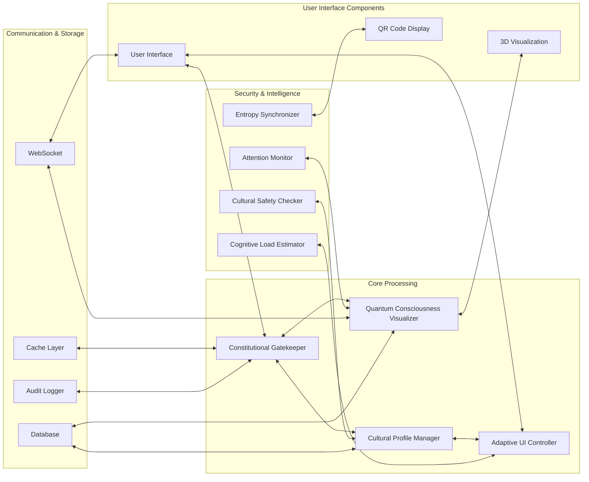

## 🧠 Consciousness Flow Diagrams

### Consciousness State Monitoring Flow
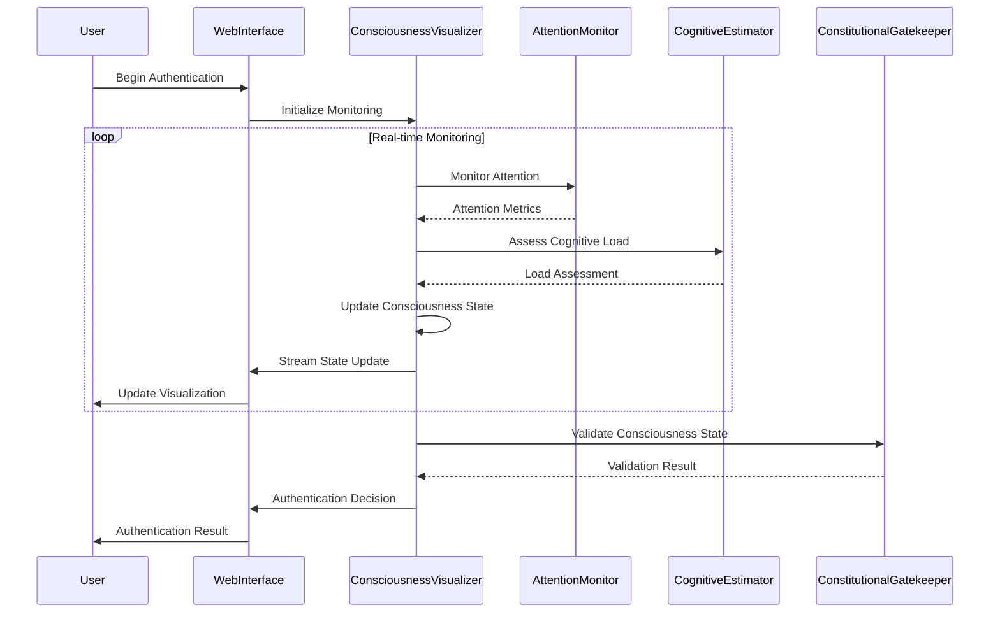

### Consciousness Evolution Tracking
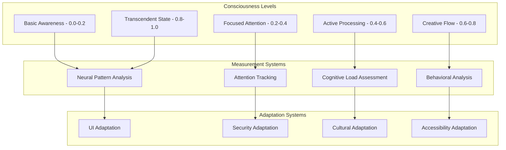

## 🌍 Cultural Intelligence Diagrams

### Cultural Adaptation Flow
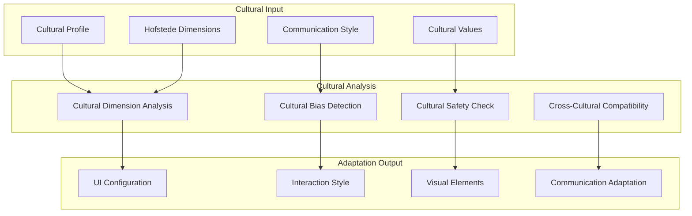

### Cross-Cultural Communication Matrix
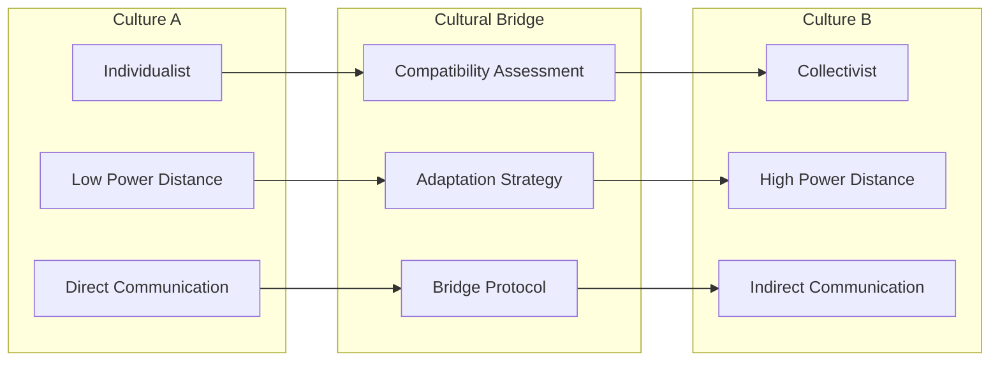

## 🔐 Security Architecture Diagrams

### Multi-Layer Security Model
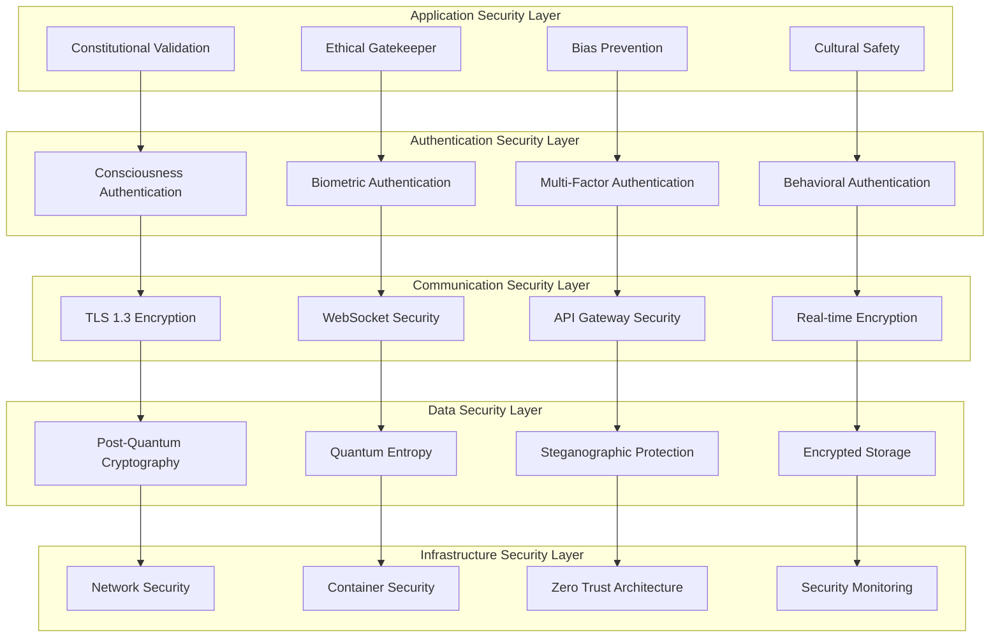

### Quantum Security Architecture
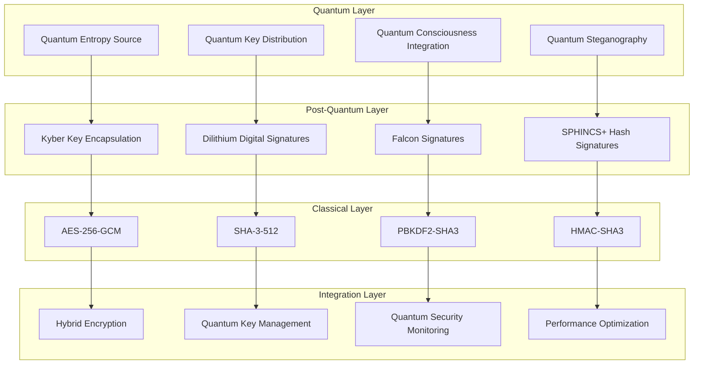

## 📱 Mobile & Web Integration Diagrams

### Multi-Platform Architecture
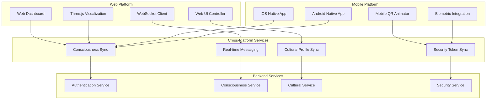

### Device Synchronization Flow
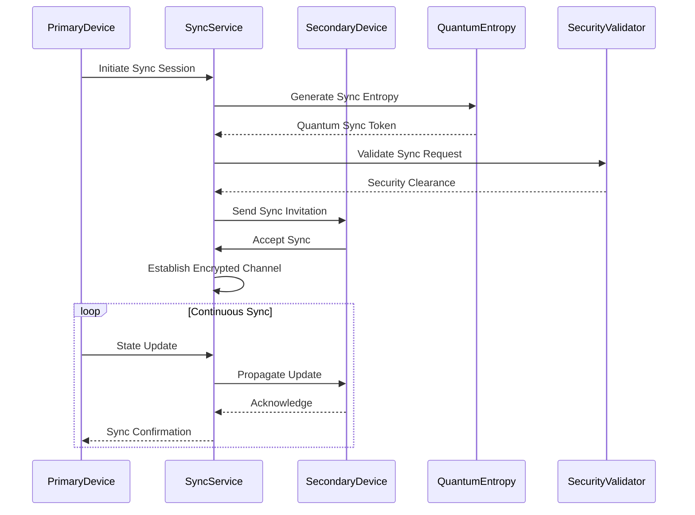

## 🔄 Data Flow Diagrams

### End-to-End Authentication Data Flow
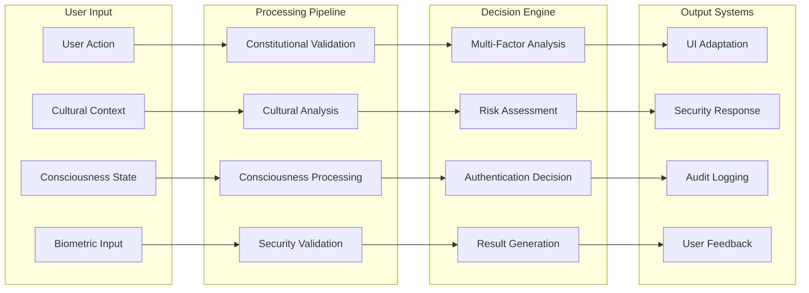

### Real-Time Data Streaming
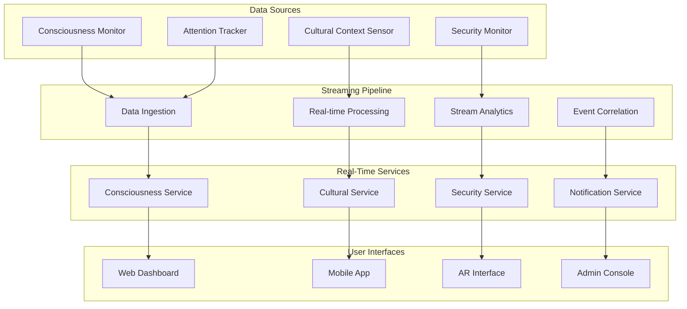

## 🚨 Emergency Response Diagrams

### Emergency Protocol Activation
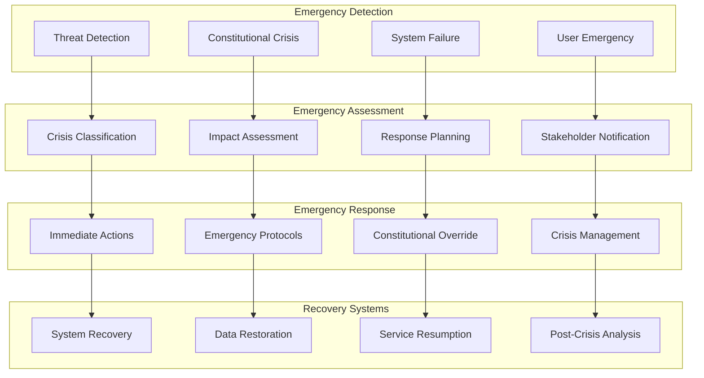

## 🔮 Future Evolution Diagrams

### Consciousness Evolution Pathway
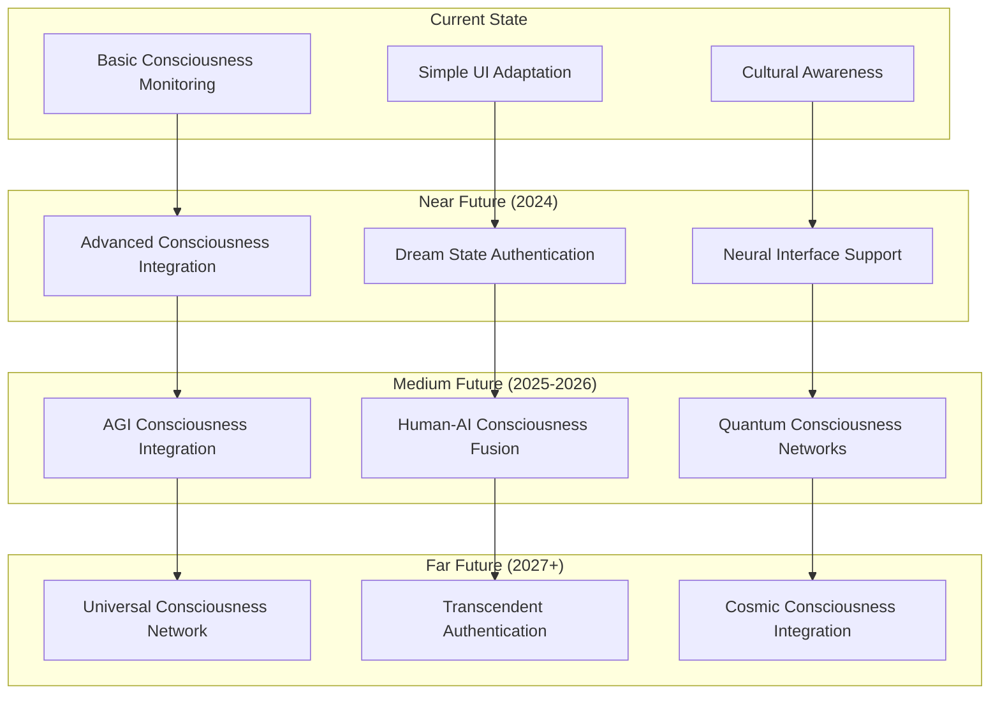

---

**LUKHAS Authentication System Diagrams** - *Visual Architecture for Consciousness-Aware Security*

*"Diagrams that illuminate the complex beauty of consciousness-integrated authentication systems."*

**Last Updated**: January 2024  
**Diagram Format**: Mermaid.js for interactive web rendering  
**Usage**: Reference for system understanding, development planning, and stakeholder communication
