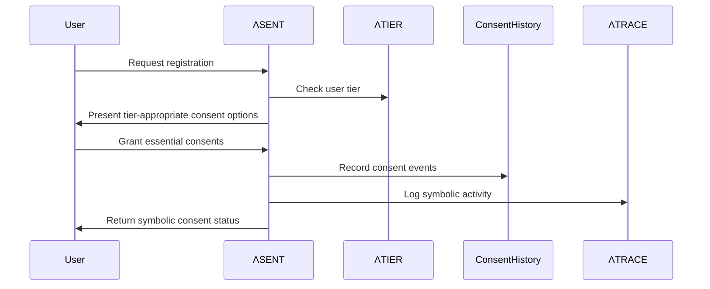
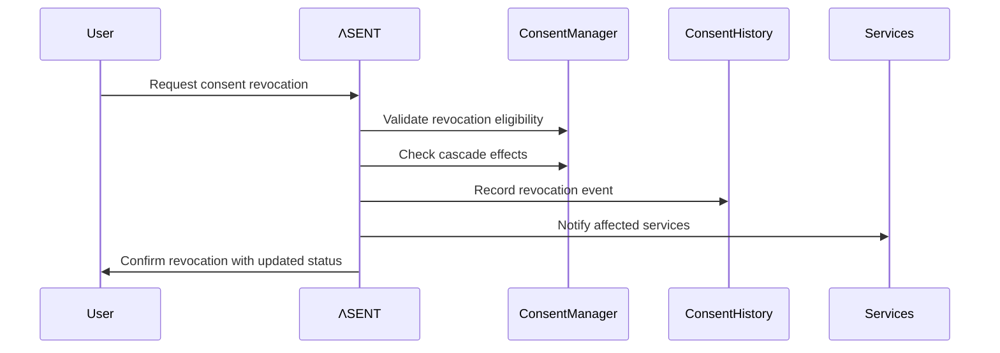

# ΛSENT Technical Documentation
## Symbolic Consent Engine for LUKHAS Ecosystem

---

## 🎯 Overview

**ΛSENT** (Lambda Symbolic Engagement and Trust) is an advanced consent management system designed for the LUKHAS ΛiD ecosystem. It provides tier-aware consent boundaries, symbolic representation, and immutable consent trails with blockchain integration.

---

## 🏗️ Architecture

### Core Components

```
ΛSENT System Architecture
├── 📋 ConsentManager        → Core lifecycle management
├── 🎯 SymbolicScopesManager → Symbolic scope representation  
├── 🔗 ConsentHistoryManager → Immutable trail management
├── ⚙️ PolicyEngine          → Policy and compliance validation
└── 📊 TierConfiguration     → Tier-aware consent boundaries
```

### Integration Points

- **ΛTRACE**: Activity logging and audit trails
- **ΛTIER**: Tier-based access control validation
- **ΛSING**: SSO integration for cross-service consent
- **VeriFold**: Blockchain verification for immutable proofs

---

## 🔧 Technical Implementation

### 1. Consent Manager (`consent_manager.py`)

**Primary Functions:**
```python
def collect_consent(user_id: str, consent_scope: str, metadata: dict) -> dict
def validate_consent(user_id: str, action_type: str) -> bool
def revoke_consent(user_id: str, consent_scope: str) -> dict
def get_consent_status(user_id: str) -> dict
```

**Key Features:**
- Tier validation before consent collection
- Symbolic representation generation
- Integration with consent history for immutable trails
- Real-time consent validation

### 2. Symbolic Scopes Manager (`symbolic_scopes.py`)

**Scope Symbols:**
```python
scope_symbols = {
    'replay': '🔄',    # Session/memory replay
    'memory': '🧠',    # Brain/dream access
    'biometric': '👁️', # Biometric data usage
    'location': '📍',  # Location tracking
    'audio': '🎵',     # Voice/audio processing
    'analytics': '📊', # Behavioral analysis
    'integration': '🔗', # Third-party services
    'trace': '👁️‍🗨️'     # Activity logging
}
```

**Core Functions:**
```python
def define_scope(scope_name: str, symbol: str, description: str, tier_requirements: dict)
def get_scope_requirements(scope_name: str, user_tier: int) -> dict
def get_symbolic_representation(consented_scopes: list) -> str
def parse_symbolic_consent(symbolic_string: str) -> list
```

### 3. Consent History Manager (`consent_history.py`)

**Immutable Trail Features:**
- **Hash-chain verification**: Each consent event linked to previous via cryptographic hash
- **ΛTRACE integration**: Symbolic logging of all consent events
- **Zero-knowledge proofs**: Privacy-preserving consent validation (future)
- **Timeline generation**: Chronological consent event tracking

**Core Functions:**
```python
def record_consent_event(user_id: str, event_type: str, scope_data: dict, metadata: dict) -> str
def verify_consent_chain(user_id: str) -> bool
def get_consent_timeline(user_id: str, scope: Optional[str] = None) -> List[dict]
def generate_consent_proof(user_id: str, scope: str, timestamp: str = None) -> dict
```

---

## 📊 Tier-Aware Consent System

### Tier Boundaries

| Tier | Level | Available Scopes | Restricted Scopes |
|------|-------|------------------|-------------------|
| **0** | 🟢 Basic | `basic_interaction`, `essential_functions` | All advanced scopes |
| **1** | 🔵 Standard | + `audio`, `trace` | `memory`, `replay`, `biometric`, `location`, `integration` |
| **2** | 🟡 Enhanced | + `analytics`, `location` | `memory`, `replay`, `biometric`, `integration` |
| **3** | 🟠 Advanced | + `biometric` | `memory`, `replay`, `integration` |
| **4** | 🔴 Premium | + `memory` | `replay`, `integration` |
| **5** | 💜 Maximum | + `replay`, `integration` | None |

### Consent Requirements by Tier

- **Enhanced Security**: Required for Tiers 3+ on biometric/memory scopes
- **Symbolic Verification**: Required for Tier 5 on replay/integration
- **Chain Verification**: Required for Tier 5 replay with VeriFold integration

---

## 🔐 Security Features

### 1. Immutable Consent Trails
```python
# Each consent record includes:
{
    'user_id': 'Λ1‿2847#',
    'event_type': 'granted',  # granted, revoked, updated
    'scope_data': {'memory': {...}},
    'timestamp': '2025-07-05T14:30:00Z',
    'hash': 'sha256_hash_of_record',
    'previous_hash': 'hash_of_previous_record'
}
```

### 2. Symbolic Consent Representation
```python
# Example symbolic consent status
user_consent = "🔄🧠📍🎵📊"  # replay + memory + location + audio + analytics
```

### 3. Zero-Knowledge Proofs (Future)
- Prove consent exists without revealing scope details
- Verify consent validity without exposing consent history
- Privacy-preserving compliance validation

---

## 🌐 API Integration

### REST Endpoints

```http
POST /api/consent/collect
POST /api/consent/revoke  
GET  /api/consent/status/{user_id}
GET  /api/consent/history/{user_id}
POST /api/consent/verify
```

### Example API Usage

```python
# Collect consent
response = consent_api.collect_consent(
    user_id="Λ1‿2847#",
    scope="memory",
    metadata={"ip_address": "192.168.1.1", "device": "mobile"}
)

# Response
{
    "success": true,
    "consent_hash": "abc123...",
    "symbolic_representation": "🧠✅",
    "active_scopes": ["basic_interaction", "audio", "memory"]
}
```

---

## 📋 Configuration Files

### 1. `consent_policies.json`
- Policy types with symbolic representation
- Revocation policies and cooling-off periods
- Compliance framework configuration
- Zero-knowledge integration settings

### 2. `consent_tiers.json`
- Tier-specific consent boundaries
- Scope availability per tier
- Consent requirement definitions
- Validation rules and restrictions

---

## 🔄 Workflow Examples

### 1. New User Onboarding


### 2. Consent Revocation


---

## 🧪 Testing Strategy

### Unit Tests
- Individual component functionality
- Consent lifecycle operations
- Symbolic representation accuracy
- Hash-chain integrity validation

### Integration Tests  
- ΛTRACE logging integration
- ΛTIER boundary validation
- Cross-service consent propagation
- API endpoint functionality

### Security Tests
- Hash-chain tamper detection
- Consent bypass attempt prevention
- Symbolic parsing security
- Privacy preservation validation

---

## 🚀 Future Enhancements

### Phase 1: Core Implementation
- [ ] Complete consent manager implementation
- [ ] Symbolic scope system deployment  
- [ ] Basic tier validation
- [ ] ΛTRACE integration

### Phase 2: Advanced Features
- [ ] Zero-knowledge proof integration
- [ ] VeriFold blockchain connection
- [ ] Advanced pattern analysis
- [ ] Multi-jurisdiction compliance

### Phase 3: Ecosystem Expansion
- [ ] Cross-platform synchronization
- [ ] AI-powered consent recommendations
- [ ] Predictive consent modeling
- [ ] Quantum-safe cryptography

---

## 📚 References

- [ΛSENT Core Implementation](../core/sent/)
- [Tier Configuration Reference](../config/consent_tiers.json)
- [API Documentation](../api/auth/)
- [Compliance Guidelines](./compliance/)

---

**Last Updated**: July 5, 2025  
**Version**: 2.0.0  
**Authors**: LUKHAS Team
