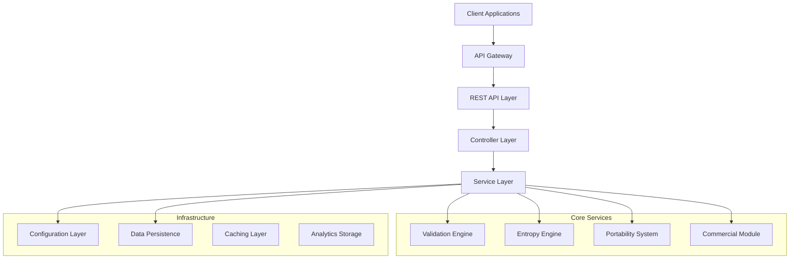

# LUKHAS ΛiD Technical Architecture Guide

**Version:** 2.0.0  
**Target Audience:** Developers, System Architects, DevOps Engineers  
**Last Updated:** July 5, 2025

---

## Architecture Overview

### Design Principles

1. **Service-Oriented Architecture (SOA)**: Modular services for scalability
2. **Cross-Platform Compatibility**: Reusable components across platforms
3. **Security by Design**: Built-in security at every layer
4. **Configuration-Driven**: External configuration for flexibility
5. **Enterprise-Ready**: Scalable, maintainable, and auditable

### System Components



---

## Core Service Classes

### 1. LambdaIDService

**File:** `core/lambd_id_service.py`

**Purpose:** Central orchestration service for all ΛiD operations.

**Key Methods:**

```python
class LambdaIDService:
    def __init__(self, config_path: Optional[str] = None, database_adapter=None)
    
    # Generation Methods
    def generate_lambda_id(self, user_context: UserContext, options: Dict[str, Any] = None) -> LambdaIDResult
    def generate_batch(self, user_contexts: List[UserContext], count: int = 1) -> List[LambdaIDResult]
    def generate_with_custom_symbolic(self, user_context: UserContext, symbolic_char: str) -> LambdaIDResult
    
    # Validation Methods
    def validate_lambda_id(self, lambda_id: str, validation_level: ValidationLevel = ValidationLevel.STANDARD) -> ValidationResult
    def validate_batch(self, lambda_ids: List[str], validation_level: ValidationLevel = ValidationLevel.STANDARD) -> List[ValidationResult]
    
    # Management Methods
    def get_lambda_id_info(self, lambda_id: str) -> Dict[str, Any]
    def upgrade_lambda_id(self, lambda_id: str, new_tier: int, user_context: UserContext) -> LambdaIDResult
    def delete_lambda_id(self, lambda_id: str, user_context: UserContext) -> bool
    
    # Analytics Methods
    def get_generation_stats(self, user_id: Optional[str] = None) -> Dict[str, Any]
    def get_tier_distribution(self) -> Dict[str, int]
```

**Data Classes:**

```python
@dataclass
class UserContext:
    user_id: str
    tier: int
    geo_location: Optional[Dict[str, float]] = None
    commercial_account: bool = False
    brand_prefix: Optional[str] = None
    preferences: Dict[str, Any] = field(default_factory=dict)

@dataclass
class LambdaIDResult:
    lambda_id: str
    success: bool
    generation_time: datetime
    entropy_score: float
    validation_result: 'ValidationResult'
    portability_package: Optional[Dict[str, Any]] = None
    metadata: Dict[str, Any] = field(default_factory=dict)
    errors: List[str] = field(default_factory=list)
```

### 2. ValidationEngine

**File:** `core/id_service/lambd_id_validator.py`

**Purpose:** Multi-level validation with collision detection.

**Validation Architecture:**

```python
class LambdaIDValidator:
    def __init__(self, config_path: Optional[str] = None, database_adapter=None)
    
    # Core Validation
    def validate(self, lambda_id: str, validation_level: ValidationLevel, context: Optional[Dict] = None) -> ValidationResult
    
    # Collision Detection
    def check_collision(self, lambda_id: str) -> bool
    def validate_batch(self, lambda_ids: List[str], validation_level: ValidationLevel) -> List[ValidationResult]
    
    # Specialized Validation
    def validate_geo_code_format(self, geo_code: str) -> Tuple[bool, List[str]]
    def validate_emoji_word_combo(self, combo: str, tier: int) -> Tuple[bool, List[str]]
    
    # Statistics
    def get_collision_stats(self) -> Dict[str, Any]
```

**Validation Levels:**

```python
class ValidationLevel(Enum):
    BASIC = "basic"           # Format validation only
    STANDARD = "standard"     # Format + tier compliance
    FULL = "full"            # Standard + collision + entropy
    ENTERPRISE = "enterprise" # Full + commercial compliance
```

### 3. EntropyEngine

**File:** `core/id_service/entropy_engine.py`

**Purpose:** Advanced entropy analysis and optimization.

**Core Features:**

```python
class LambdaIDEntropyEngine:
    def __init__(self, config_path: Optional[str] = None)
    
    # Analysis Methods
    def analyze_entropy(self, lambda_id: str, tier: Optional[int] = None) -> EntropyAnalysis
    def calculate_live_entropy(self, partial_id: str, tier: int) -> Dict[str, Any]
    def optimize_lambda_id(self, lambda_id: str, target_tier: int) -> Dict[str, Any]
    
    # Batch Operations
    def batch_entropy_analysis(self, lambda_ids: List[str]) -> List[EntropyAnalysis]
    
    # Statistics
    def get_entropy_statistics(self) -> Dict[str, Any]
```

**Entropy Calculation:**

```python
def _calculate_shannon_entropy(self, text: str) -> float:
    """
    Shannon Entropy Formula: H(X) = -Σ P(xi) * log2(P(xi))
    
    With boost factors:
    - Unicode symbols: 1.3x multiplier
    - Pattern complexity: up to 1.4x multiplier
    - Character diversity: up to 1.3x multiplier
    """
```

### 4. PortabilitySystem

**File:** `core/id_service/portability_system.py`

**Purpose:** Comprehensive recovery and cross-device sync.

**Recovery Methods:**

```python
class LambdaIDPortabilitySystem:
    def __init__(self, config_path: Optional[str] = None)
    
    # Package Creation
    def create_portability_package(self, lambda_id: str, methods: List[RecoveryMethod], 
                                 geo_location: Optional[Dict] = None, security_level: str = "standard") -> PortabilityPackage
    
    # QR-G Recovery
    def generate_qr_geo_recovery(self, lambda_id: str, geo_location: Dict, security_level: str = "standard") -> Dict
    def recover_from_qr_geo(self, qr_payload: str, current_location: Optional[Dict] = None) -> RecoveryAttempt
    
    # Emergency Codes
    def generate_emergency_codes(self, lambda_id: str, count: int = 10) -> List[str]
    def recover_from_emergency_code(self, emergency_code: str, additional_verification: Optional[Dict] = None) -> RecoveryAttempt
    
    # Recovery Phrases
    def generate_recovery_phrase(self, lambda_id: str) -> str
    def recover_from_phrase(self, recovery_phrase: str) -> RecoveryAttempt
    
    # Cross-Device Sync
    def sync_across_devices(self, lambda_id: str, source_device: str, target_devices: List[str]) -> Dict
    
    # Backup/Restore
    def create_backup_file(self, lambda_id: str, password: str) -> Dict
    def restore_from_backup(self, backup_file: str, password: str) -> RecoveryAttempt
```

---

## Branded ΛiD Prefix Design Analysis

### Critical Design Considerations

Before implementing commercial features, I need to carefully analyze the branded ΛiD prefix challenge:

#### **Challenge 1: Format Compatibility**
- Current format: `LUKHAS{TIER}-{TIMESTAMP}-{SYMBOLIC}-{ENTROPY}`
- Need to maintain backward compatibility
- Validation systems must handle both formats

#### **Challenge 2: Collision Prevention**
- Branded and standard ΛiDs must not collide
- Different namespaces or validation rules needed
- Database schema considerations

#### **Challenge 3: Tier Integration**
- How do branded ΛiDs interact with tier system?
- Do branded ΛiDs have separate tier hierarchy?
- Validation and permissions complexity

### **Recommended Approach: Hybrid Namespace System**

I propose implementing **three distinct ΛiD formats** to handle different use cases:

#### **1. Standard ΛiDs (Current)**
```
Format: LUKHAS{TIER}-{TIMESTAMP}-{SYMBOLIC}-{ENTROPY}
Example: Λ3-A1B2-🔮-C3D4
Use Case: Individual users, standard tier system
```

#### **2. Commercial ΛiDs (New)**
```
Format: LUKHAS©{BRAND_CODE}-{TIER}-{TIMESTAMP}-{SYMBOLIC}-{ENTROPY}
Example: LUKHAS©MSFT-3-A1B2-Ⓜ-C3D4
Use Case: Corporate accounts with brand identity
```

#### **3. Enterprise ΛiDs (New)**
```
Format: ΛE{ORG_ID}-{DEPT}-{TIMESTAMP}-{SYMBOLIC}-{ENTROPY}
Example: ΛE001-HR-A1B2-⚡-C3D4
Use Case: Large organizations with internal structure
```

### **Implementation Benefits:**

1. **Clear Separation**: Each format serves different needs
2. **No Collisions**: Different prefixes prevent conflicts
3. **Backward Compatibility**: Standard ΛiDs unchanged
4. **Scalable**: Can add more formats in future
5. **Validation**: Each format has specific validation rules

### **Database Schema Impact:**

```sql
-- Enhanced lambda_ids table
ALTER TABLE lambda_ids ADD COLUMN lambda_id_type VARCHAR(20) DEFAULT 'standard';
ALTER TABLE lambda_ids ADD COLUMN brand_code VARCHAR(10);
ALTER TABLE lambda_ids ADD COLUMN organization_id VARCHAR(20);

-- Index for branded ΛiDs
CREATE INDEX idx_lambda_ids_brand_code ON lambda_ids(brand_code) WHERE brand_code IS NOT NULL;
```

Would you like me to proceed with implementing **Priority 6: Commercial Module** using this hybrid namespace approach? This will provide a solid foundation for branded ΛiDs while maintaining system integrity.
