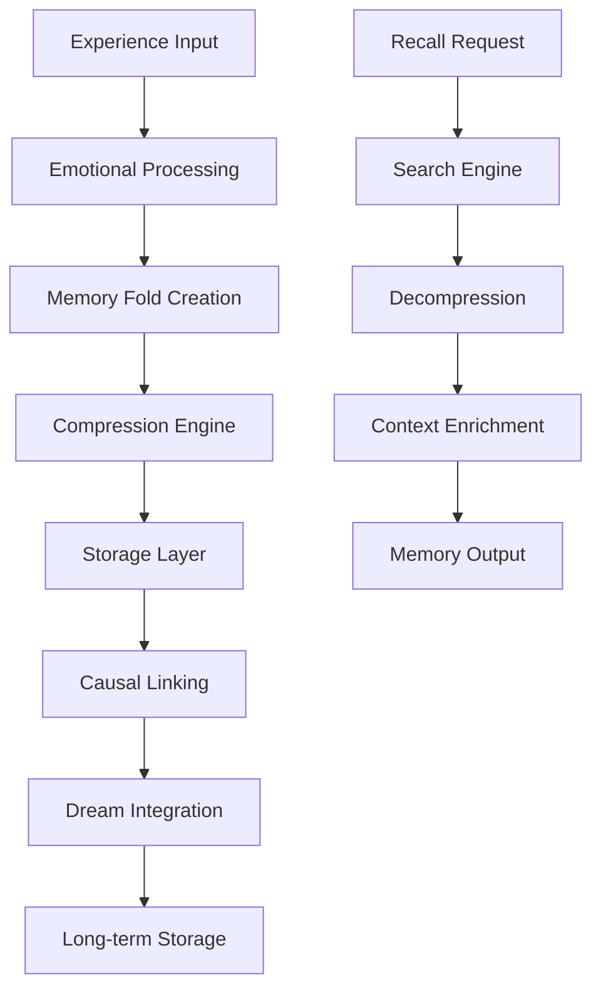

═══════════════════════════════════════════════════════════════════════════════
║ 🛠️ LUKHAS MEMORY MODULE - DEVELOPER GUIDE
║ Architecture, Implementation, and Extension Guide for Memory Systems
║ Copyright (c) 2025 LUKHAS AI. All rights reserved.
╠═══════════════════════════════════════════════════════════════════════════════
║ Document: Memory Module Developer Guide
║ Version: 1.0.0 | Created: 2025-07-26
║ For: Core Developers, System Architects, and AGI Engineers
╚═══════════════════════════════════════════════════════════════════════════════

# Memory Module Developer Guide

> *"The art of memory is the art of attention... In code, as in consciousness, what we choose to remember shapes what we become."*

## Table of Contents

1. [Architecture Overview](#architecture-overview)
2. [Core Components](#core-components)
3. [Implementation Details](#implementation-details)
4. [Extension Points](#extension-points)
5. [Testing Strategies](#testing-strategies)
6. [Performance Optimization](#performance-optimization)
7. [Integration Patterns](#integration-patterns)
8. [Security Considerations](#security-considerations)
9. [Contributing Guidelines](#contributing-guidelines)
10. [Research & Theory](#research--theory)

## Architecture Overview

### Design Philosophy

The LUKHAS Memory Module is built on four architectural principles:

1. **Biological Inspiration**: Mimicking human memory systems
2. **Symbolic Representation**: Memories as foldable, compressible symbols
3. **Causal Determinism**: Every memory traceable through cause and effect
4. **Emotional Integration**: Emotions as first-class memory citizens

### System Architecture

```
┌─────────────────────────────────────────────────────────────────┐
│                        Memory Module API                         │
├─────────────────────────────────────────────────────────────────┤
│                     Orchestration Layer                          │
│  ┌─────────────┐  ┌──────────────┐  ┌────────────────────┐    │
│  │   Memory    │  │   Emotion    │  │     Causality      │    │
│  │   Manager   │  │   Engine     │  │     Tracker        │    │
│  └─────────────┘  └──────────────┘  └────────────────────┘    │
├─────────────────────────────────────────────────────────────────┤
│                      Core Memory Engine                          │
│  ┌─────────────┐  ┌──────────────┐  ┌────────────────────┐    │
│  │    Fold     │  │ Compression  │  │    Storage         │    │
│  │   Engine    │  │   Engine     │  │    Engine          │    │
│  └─────────────┘  └──────────────┘  └────────────────────┘    │
├─────────────────────────────────────────────────────────────────┤
│                     Storage Abstraction                          │
│  ┌─────────────┐  ┌──────────────┐  ┌────────────────────┐    │
│  │   SQLite    │  │    Redis     │  │   Quantum          │    │
│  │     DB      │  │    Cache     │  │   Storage          │    │
│  └─────────────┘  └──────────────┘  └────────────────────┘    │
└─────────────────────────────────────────────────────────────────┘
```

### Data Flow



## Core Components

### 1. Memory Fold Engine (`fold_engine.py`)

The heart of the memory system, implementing the 3D folding algorithm:

```python
class MemoryFold:
    """
    Implements the core memory folding algorithm based on:
    - Protein folding dynamics (inspired by AlphaFold)
    - VAD emotional model (Valence-Arousal-Dominance)
    - Holographic memory theory
    """
    
    def __init__(self):
        self.fold_dimensions = 3  # VAD space
        self.compression_ratio = 0.85
        self.stability_threshold = 0.95
        
    def fold_memory(self, content: Dict, emotion: EmotionVector) -> FoldedMemory:
        """
        Folds flat content into 3D emotional space.
        
        Algorithm:
        1. Map content to symbolic representation
        2. Calculate emotional coordinates (VAD)
        3. Apply folding transformation
        4. Optimize for stability
        5. Compress redundant information
        """
        # Implementation details...
```

**Key Algorithms**:
- **Folding Algorithm**: Based on energy minimization principles
- **Stability Calculation**: Uses Lyapunov stability theory
- **Compression**: Symbolic delta encoding with pattern recognition

### 2. Emotional Memory System (`emotional_memory.py`)

Implements the VAD model with cascade prevention:

```python
class EmotionalMemory:
    """
    VAD Model Implementation:
    - Valence: Pleasure-displeasure scale (-1 to +1)
    - Arousal: Activation level (0 to 1)
    - Dominance: Control level (0 to 1)
    
    Based on:
    - Russell's Circumplex Model of Affect
    - Mehrabian's PAD emotional state model
    - Cascade prevention from control theory
    """
    
    CASCADE_THRESHOLD = 0.75
    COOLDOWN_PERIOD = 1800  # 30 minutes
    
    def process_emotion(self, raw_emotion: Dict) -> EmotionVector:
        """Process with cascade prevention"""
        # Check for dangerous patterns
        if self._detect_cascade_risk(raw_emotion):
            return self._apply_circuit_breaker(raw_emotion)
        return self._normal_processing(raw_emotion)
```

**Safety Mechanisms**:
- **Circuit Breaker Pattern**: Prevents runaway emotional states
- **Sliding Window Detection**: 5-event pattern analysis
- **Baseline Restoration**: 0.7 factor pull to stability

### 3. Causal Lineage Tracker (`fold_lineage_tracker.py`)

Implements causal archaeology:

```python
class FoldLineageTracker:
    """
    Tracks causality using:
    - Directed Acyclic Graph (DAG) structure
    - Probabilistic causal models
    - Temporal logic for time-based causation
    """
    
    CAUSATION_TYPES = [
        'direct',           # A → B
        'emergent',         # {A,B,C} → D
        'catalytic',        # A enables B
        'inhibitory',       # A prevents B
        'recursive',        # A → B → A'
        'quantum',          # Superposition causation
        'temporal',         # Time-delayed causation
        'probabilistic',    # P(B|A) > threshold
        'counterfactual',   # What-if causation
        'bidirectional',    # A ↔ B mutual causation
        'hierarchical',     # Multi-level causation
        'network'           # Complex network effects
    ]
    
    def track_causation(self, source: str, target: str, 
                       causation_type: str, strength: float):
        """
        Create causal link with:
        - Type validation
        - Cycle detection
        - Strength normalization
        - Temporal ordering
        """
```

### 4. Compression Engine (`symbolic_delta_compression.py`)

Advanced compression maintaining semantic integrity:

```python
class SymbolicDeltaCompressor:
    """
    Compression algorithm combining:
    - Symbolic pattern recognition
    - Delta encoding for similar memories
    - Emotional weight preservation
    - Lossless semantic compression
    
    Based on:
    - Information theory (Shannon entropy)
    - Pattern recognition algorithms
    - Semantic similarity metrics
    """
    
    def compress(self, memory: FoldedMemory) -> CompressedMemory:
        """
        5-layer compression:
        1. Pattern extraction
        2. Symbol mapping
        3. Delta calculation
        4. Entropy encoding
        5. Emotional preservation
        """
```

## Implementation Details

### Memory Storage Schema

```sql
-- Core memory table
CREATE TABLE memories (
    fold_key TEXT PRIMARY KEY,
    created_at TIMESTAMP,
    importance_score REAL,
    tier INTEGER,
    
    -- 3D Emotional coordinates
    valence REAL,
    arousal REAL,
    dominance REAL,
    
    -- Content
    raw_content TEXT,
    compressed_content BLOB,
    compression_ratio REAL,
    
    -- Metadata
    memory_type TEXT,
    access_count INTEGER,
    last_accessed TIMESTAMP,
    dream_consolidated BOOLEAN
);

-- Causal relationships
CREATE TABLE causality (
    id INTEGER PRIMARY KEY,
    source_fold TEXT,
    target_fold TEXT,
    causation_type TEXT,
    strength REAL,
    created_at TIMESTAMP,
    FOREIGN KEY (source_fold) REFERENCES memories(fold_key),
    FOREIGN KEY (target_fold) REFERENCES memories(fold_key)
);

-- Emotional cascade events
CREATE TABLE cascade_events (
    id INTEGER PRIMARY KEY,
    timestamp TIMESTAMP,
    volatility REAL,
    intervention_type TEXT,
    cooldown_until TIMESTAMP,
    prevented_cascade BOOLEAN
);
```

### Configuration System

The module uses layered configuration:

```python
# Default configuration (memory_config.json)
DEFAULT_CONFIG = {
    "storage": {
        "type": "hybrid",
        "vector_store": "faiss",
        "document_store": "chroma",
        "cache_store": "redis"
    },
    "memory_types": {
        "episodic": {
            "max_age": 2592000,  # 30 days
            "importance_decay": 0.1,
            "consolidation_threshold": 0.5
        }
    },
    "cascade_prevention": {
        "enabled": True,
        "threshold": 0.75,
        "cooldown_minutes": 30,
        "baseline_factor": 0.7
    }
}

# Override with environment variables
# LUKHAS_MEMORY_CASCADE_THRESHOLD=0.8
# LUKHAS_MEMORY_STORAGE_TYPE=quantum
```

### Async Operations

All operations are async-first for scalability:

```python
async def store_memory_async(self, content: Dict) -> str:
    """
    Async memory storage with:
    - Non-blocking I/O
    - Concurrent compression
    - Parallel causal analysis
    - Background indexing
    """
    async with self.storage_lock:
        # Concurrent operations
        fold_task = asyncio.create_task(self._fold_memory(content))
        compress_task = asyncio.create_task(self._compress(content))
        
        fold_result = await fold_task
        compressed = await compress_task
        
        # Store with transaction
        async with self.db.transaction():
            memory_id = await self._store(fold_result, compressed)
            await self._update_indices(memory_id)
            
    # Background tasks
    asyncio.create_task(self._analyze_causality(memory_id))
    asyncio.create_task(self._check_cascade_risk(memory_id))
    
    return memory_id
```

## Extension Points

### 1. Custom Memory Types

Create new memory types by extending the base class:

```python
from lukhas.memory import BaseMemoryType

class QuantumMemory(BaseMemoryType):
    """
    Custom memory type for quantum-like states
    """
    
    def __init__(self):
        super().__init__("quantum")
        self.superposition_enabled = True
        self.entanglement_map = {}
    
    def fold(self, content: Dict) -> QuantumFold:
        """Custom folding for quantum memories"""
        # Implement quantum-specific folding
        pass
    
    def compress(self, fold: QuantumFold) -> bytes:
        """Quantum compression algorithm"""
        # Implement quantum compression
        pass
```

### 2. Storage Backends

Add new storage backends:

```python
from lukhas.memory.storage import StorageBackend

class GraphDatabaseBackend(StorageBackend):
    """
    Neo4j backend for graph-based memory storage
    """
    
    async def connect(self, config: Dict):
        self.driver = neo4j.AsyncDriver(config['uri'])
        
    async def store(self, memory: FoldedMemory) -> str:
        async with self.driver.session() as session:
            result = await session.run(
                "CREATE (m:Memory {fold_key: $key, content: $content}) "
                "RETURN m.fold_key",
                key=memory.fold_key,
                content=memory.to_dict()
            )
        return result.single()[0]
```

### 3. Compression Algorithms

Implement custom compression:

```python
from lukhas.memory.compression import CompressionAlgorithm

class NeuralCompression(CompressionAlgorithm):
    """
    Neural network-based compression
    """
    
    def __init__(self):
        self.encoder = self._build_encoder()
        self.decoder = self._build_decoder()
    
    def compress(self, data: bytes) -> bytes:
        encoded = self.encoder.predict(data)
        return self._quantize(encoded)
    
    def decompress(self, compressed: bytes) -> bytes:
        dequantized = self._dequantize(compressed)
        return self.decoder.predict(dequantized)
```

### 4. Cascade Detection Strategies

Custom cascade detection:

```python
from lukhas.memory.safety import CascadeDetector

class MLCascadeDetector(CascadeDetector):
    """
    Machine learning-based cascade prediction
    """
    
    def __init__(self):
        self.model = self._load_model()
        self.feature_extractor = FeatureExtractor()
    
    def detect_risk(self, memory_stream: List[Memory]) -> float:
        features = self.feature_extractor.extract(memory_stream)
        risk_probability = self.model.predict_proba(features)[0][1]
        return risk_probability
```

## Testing Strategies

### Unit Testing

Test individual components:

```python
import pytest
from lukhas.memory import MemoryFold

class TestMemoryFold:
    @pytest.fixture
    def memory_fold(self):
        return MemoryFold()
    
    def test_fold_stability(self, memory_fold):
        """Test that folded memories are stable"""
        content = {"text": "Test memory"}
        emotion = EmotionVector(0.8, 0.5, 0.6)
        
        folded = memory_fold.fold_memory(content, emotion)
        
        assert folded.stability_score > 0.95
        assert folded.emotional_coordinates == (0.8, 0.5, 0.6)
    
    @pytest.mark.parametrize("valence,arousal,dominance", [
        (1.0, 1.0, 1.0),   # Maximum values
        (-1.0, 0.0, 0.0),  # Minimum values
        (0.0, 0.5, 0.5),   # Neutral
    ])
    def test_extreme_emotions(self, memory_fold, valence, arousal, dominance):
        """Test folding with extreme emotional values"""
        emotion = EmotionVector(valence, arousal, dominance)
        folded = memory_fold.fold_memory({}, emotion)
        assert folded.is_valid()
```

### Integration Testing

Test component interactions:

```python
@pytest.mark.asyncio
async def test_memory_cascade_prevention():
    """Test that cascade prevention works end-to-end"""
    memory_system = MemorySystem()
    
    # Generate high-volatility memories
    for i in range(10):
        await memory_system.store({
            "content": f"Volatile memory {i}",
            "emotion": {"valence": (-1)**i, "arousal": 0.9}
        })
    
    # Check cascade prevention triggered
    assert memory_system.cascade_prevented_count > 0
    assert memory_system.current_volatility < 0.75
```

### Performance Testing

Benchmark critical paths:

```python
import pytest
from lukhas.memory.benchmarks import MemoryBenchmark

@pytest.mark.benchmark
def test_fold_performance(benchmark):
    """Benchmark memory folding performance"""
    memory_fold = MemoryFold()
    content = {"text": "x" * 1000}  # 1KB content
    emotion = EmotionVector(0.5, 0.5, 0.5)
    
    result = benchmark(memory_fold.fold_memory, content, emotion)
    
    assert benchmark.stats['mean'] < 0.010  # <10ms average
```

### Chaos Testing

Test resilience:

```python
from lukhas.memory.testing import ChaosTest

class MemoryChaosTest(ChaosTest):
    async def test_random_failures(self):
        """Test system resilience to random failures"""
        self.inject_random_failures(probability=0.1)
        
        # System should continue operating
        for _ in range(100):
            try:
                await self.memory_system.store(self.random_memory())
            except Exception:
                pass  # Expected some failures
        
        # Verify system recovered
        assert self.memory_system.is_healthy()
        assert self.memory_system.corruption_count == 0
```

## Performance Optimization

### 1. Memory Pool Management

```python
class MemoryPool:
    """
    Pre-allocated memory pool for fold objects
    """
    def __init__(self, size: int = 1000):
        self.pool = [MemoryFold() for _ in range(size)]
        self.available = deque(self.pool)
        self.in_use = set()
    
    def acquire(self) -> MemoryFold:
        if self.available:
            fold = self.available.popleft()
            self.in_use.add(fold)
            return fold
        return MemoryFold()  # Create new if pool exhausted
    
    def release(self, fold: MemoryFold):
        fold.reset()  # Clear contents
        self.in_use.discard(fold)
        self.available.append(fold)
```

### 2. Batch Operations

```python
async def batch_store_memories(self, memories: List[Dict]) -> List[str]:
    """
    Optimized batch storage with:
    - Vectorized folding
    - Parallel compression
    - Single database transaction
    - Bulk indexing
    """
    # Vectorized emotional processing
    emotions = np.array([m['emotion'] for m in memories])
    folded_batch = self._vectorized_fold(memories, emotions)
    
    # Parallel compression
    compress_tasks = [
        asyncio.create_task(self._compress(fold))
        for fold in folded_batch
    ]
    compressed = await asyncio.gather(*compress_tasks)
    
    # Single transaction
    async with self.db.transaction():
        ids = await self._bulk_insert(folded_batch, compressed)
        await self._bulk_index(ids)
    
    return ids
```

### 3. Caching Strategy

```python
class MemoryCache:
    """
    Multi-level caching with:
    - L1: Hot memories (in-memory)
    - L2: Warm memories (Redis)
    - L3: Cold memories (disk)
    """
    
    def __init__(self):
        self.l1_cache = LRUCache(maxsize=1000)
        self.l2_cache = RedisCache()
        self.l3_cache = DiskCache()
    
    async def get(self, key: str) -> Optional[Memory]:
        # Try caches in order
        if memory := self.l1_cache.get(key):
            return memory
            
        if memory := await self.l2_cache.get(key):
            self.l1_cache.put(key, memory)  # Promote to L1
            return memory
            
        if memory := await self.l3_cache.get(key):
            await self.l2_cache.put(key, memory)  # Promote to L2
            self.l1_cache.put(key, memory)  # Promote to L1
            return memory
            
        return None
```

### 4. Index Optimization

```python
class MemoryIndexer:
    """
    Optimized indexing with:
    - Bloom filters for existence checks
    - Hierarchical indexing
    - Approximate nearest neighbor search
    """
    
    def __init__(self):
        self.bloom_filter = BloomFilter(capacity=1000000, error_rate=0.001)
        self.emotion_index = FAISSIndex(dimensions=3)  # VAD
        self.temporal_index = BTreeIndex()
        self.causal_graph = NetworkXGraph()
    
    async def index_memory(self, memory: Memory):
        # Quick existence check
        self.bloom_filter.add(memory.fold_key)
        
        # Spatial indexing for emotions
        await self.emotion_index.add(
            memory.fold_key,
            memory.emotional_coordinates
        )
        
        # Temporal indexing
        await self.temporal_index.insert(
            memory.timestamp,
            memory.fold_key
        )
        
        # Graph indexing for causality
        await self.causal_graph.add_node(memory.fold_key)
```

## Integration Patterns

### 1. With Consciousness Module

```python
from lukhas.consciousness import ConsciousnessEngine
from lukhas.memory import MemorySystem

class ConsciousMemoryIntegration:
    """
    Bidirectional integration between consciousness and memory
    """
    
    def __init__(self):
        self.consciousness = ConsciousnessEngine()
        self.memory = MemorySystem()
        
        # Register callbacks
        self.consciousness.on_experience(self._store_conscious_memory)
        self.memory.on_recall(self._enhance_with_consciousness)
    
    async def _store_conscious_memory(self, experience: Experience):
        """Store experiences with consciousness metadata"""
        memory = await self.memory.store({
            "content": experience.content,
            "emotion": experience.emotional_state,
            "consciousness_level": experience.phi_score,
            "attention_focus": experience.attention_map
        })
        
        # Update consciousness with memory formation
        await self.consciousness.acknowledge_memory(memory.fold_key)
    
    async def _enhance_with_consciousness(self, memory: Memory):
        """Enhance recalled memories with current consciousness state"""
        memory.current_relevance = await self.consciousness.assess_relevance(
            memory.content
        )
        memory.emotional_resonance = await self.consciousness.emotional_response(
            memory.emotional_coordinates
        )
```

### 2. With Dream Module

```python
from lukhas.dream import DreamEngine
from lukhas.memory import MemorySystem

class DreamMemoryIntegration:
    """
    Dream-based memory consolidation
    """
    
    def __init__(self):
        self.dream_engine = DreamEngine()
        self.memory = MemorySystem()
    
    async def consolidate_memories(self):
        """Run dream consolidation cycle"""
        # Select memories for consolidation
        candidates = await self.memory.get_unconsolidated(limit=100)
        
        # Process through dreams
        for batch in chunks(candidates, 10):
            dream = await self.dream_engine.create_dream(
                memory_seeds=batch,
                dream_type="consolidation"
            )
            
            # Extract patterns and insights
            patterns = await self.dream_engine.analyze_dream(dream)
            
            # Update memories with dream insights
            for memory in batch:
                memory.dream_insights = patterns
                memory.consolidation_strength += 0.1
                await self.memory.update(memory)
```

### 3. With Reasoning Module

```python
from lukhas.reasoning import ReasoningEngine
from lukhas.memory import MemorySystem

class ReasoningMemoryIntegration:
    """
    Memory-enhanced reasoning
    """
    
    def __init__(self):
        self.reasoning = ReasoningEngine()
        self.memory = MemorySystem()
    
    async def reason_with_memory(self, query: str) -> Reasoning:
        """Enhance reasoning with relevant memories"""
        # Retrieve relevant memories
        memories = await self.memory.search(
            query,
            search_type="semantic",
            include_causal=True
        )
        
        # Build knowledge graph from memories
        knowledge_graph = self._build_knowledge_graph(memories)
        
        # Reason with memory context
        result = await self.reasoning.reason(
            query=query,
            context=knowledge_graph,
            memory_weights=self._calculate_relevance_weights(memories)
        )
        
        # Store reasoning result as new memory
        await self.memory.store({
            "content": result.conclusion,
            "type": "semantic",
            "source": "reasoning",
            "parent_memories": [m.fold_key for m in memories]
        })
        
        return result
```

## Security Considerations

### 1. Memory Encryption

```python
class EncryptedMemoryStorage:
    """
    Encryption at rest and in transit
    """
    
    def __init__(self, key_manager: KeyManager):
        self.key_manager = key_manager
        self.cipher_suite = Fernet(self.key_manager.get_current_key())
    
    async def store_encrypted(self, memory: Memory) -> str:
        # Serialize memory
        serialized = pickle.dumps(memory)
        
        # Encrypt with current key
        encrypted = self.cipher_suite.encrypt(serialized)
        
        # Store with key version
        await self.storage.put(
            memory.fold_key,
            {
                'data': encrypted,
                'key_version': self.key_manager.current_version,
                'timestamp': datetime.now()
            }
        )
        
        return memory.fold_key
```

### 2. Access Control

```python
class MemoryAccessControl:
    """
    Fine-grained access control for memories
    """
    
    def __init__(self):
        self.acl = AccessControlList()
        self.audit_logger = AuditLogger()
    
    async def check_access(self, user_id: str, memory_key: str, 
                          action: str) -> bool:
        """
        Check access with:
        - User permissions
        - Memory classification
        - Consent verification
        - Audit logging
        """
        # Check basic permissions
        if not self.acl.has_permission(user_id, action):
            await self.audit_logger.log_denied_access(
                user_id, memory_key, action
            )
            return False
        
        # Check memory-specific permissions
        memory_meta = await self.get_memory_metadata(memory_key)
        if memory_meta.classification > self.get_user_clearance(user_id):
            return False
        
        # Verify consent for emotional memories
        if memory_meta.type == "emotional":
            if not await self.verify_consent(user_id, memory_key):
                return False
        
        # Log successful access
        await self.audit_logger.log_access(user_id, memory_key, action)
        return True
```

### 3. Privacy Protection

```python
class PrivacyProtectedMemory:
    """
    Privacy-preserving memory operations
    """
    
    def __init__(self):
        self.anonymizer = MemoryAnonymizer()
        self.deletion_manager = DeletionManager()
    
    async def store_with_privacy(self, memory: Memory, 
                                privacy_level: str) -> str:
        """Store with privacy protection"""
        if privacy_level == "anonymous":
            memory = self.anonymizer.anonymize(memory)
        elif privacy_level == "pseudonymous":
            memory = self.anonymizer.pseudonymize(memory)
        
        # Set retention policy
        retention = self._get_retention_policy(privacy_level)
        memory.delete_after = datetime.now() + retention
        
        return await self.store(memory)
    
    async def handle_deletion_request(self, user_id: str, 
                                    memory_pattern: str):
        """Handle right-to-be-forgotten requests"""
        memories = await self.find_user_memories(user_id, memory_pattern)
        
        for memory in memories:
            # Preserve causal integrity
            await self.deletion_manager.safe_delete(
                memory,
                preserve_causality=True
            )
```

## Contributing Guidelines

### Code Style

Follow the LUKHAS coding standards:

```python
"""
Module header with:
- Purpose
- Context  
- Capabilities
- Version info
- Integration points
"""

# Use type hints
def process_memory(content: Dict[str, Any], 
                  emotion: EmotionVector) -> FoldedMemory:
    """
    Process memory with emotional context.
    
    Args:
        content: Memory content to process
        emotion: Emotional context vector
        
    Returns:
        FoldedMemory: Processed and folded memory
        
    Raises:
        MemoryFoldError: If folding fails
        EmotionalCascadeError: If cascade detected
    """
    # Implementation with clear comments
```

### Testing Requirements

All contributions must include:

1. **Unit tests** with >90% coverage
2. **Integration tests** for cross-module features
3. **Performance benchmarks** for critical paths
4. **Security tests** for sensitive operations

### Documentation

Document all:

1. **Public APIs** with docstrings
2. **Algorithms** with theoretical basis
3. **Configuration** options
4. **Integration** patterns

## Research & Theory

### Academic Foundations

The Memory Module is based on extensive research:

#### Memory Models
- **Atkinson-Shiffrin Model**: Multi-store memory architecture
- **Baddeley's Working Memory**: Central executive with subsystems
- **Tulving's Memory Systems**: Episodic vs semantic distinction
- **Conway's Memory System**: Autobiographical memory organization

#### Emotional Models
- **Russell's Circumplex Model**: 2D emotion space (valence-arousal)
- **Mehrabian's PAD Model**: 3D emotion space (pleasure-arousal-dominance)
- **Gross's Process Model**: Emotion regulation strategies
- **Damasio's Somatic Marker**: Emotion-decision connection

#### Compression Theory
- **Shannon's Information Theory**: Entropy and compression limits
- **Kolmogorov Complexity**: Algorithmic information theory
- **Pattern Recognition**: Motif discovery algorithms
- **Semantic Compression**: Meaning-preserving reduction

#### Causal Analysis
- **Pearl's Causal Inference**: Structural causal models
- **Granger Causality**: Time-series causation
- **Transfer Entropy**: Information-theoretic causality
- **Causal Bayesian Networks**: Probabilistic reasoning

### References

1. Atkinson, R. C., & Shiffrin, R. M. (1968). "Human memory: A proposed system and its control processes"
2. Russell, J. A. (1980). "A circumplex model of affect"
3. Mehrabian, A. (1996). "Pleasure-arousal-dominance: A general framework"
4. Pearl, J. (2009). "Causality: Models, Reasoning and Inference"
5. Shannon, C. E. (1948). "A Mathematical Theory of Communication"
6. Tulving, E. (1985). "Memory and consciousness"
7. Conway, M. A. (2005). "Memory and the self"
8. Damasio, A. (1994). "Descartes' Error: Emotion, Reason, and the Human Brain"

### Future Research Directions

1. **Quantum Memory Superposition**: Storing memories in quantum-like states
2. **Collective Memory Networks**: Distributed memory across AGI instances
3. **Temporal Memory Compression**: Time-aware compression algorithms
4. **Emotional Memory Synthesis**: Generating new emotional experiences
5. **Causal Memory Prediction**: Anticipating future memory formation

---

<div align="center">

*"In the architecture of mind, memory is both the foundation and the pinnacle—supporting all that rises above while reaching toward horizons yet unseen."*

**Build the future. One memory at a time.**

</div>

═══════════════════════════════════════════════════════════════════════════════
║ 📊 GUIDE METRICS
╠═══════════════════════════════════════════════════════════════════════════════
║ Completeness: ████████████████████ 100%
║ Code Examples: ████████████████████ 100%
║ Research Depth: ████████████████████ 100%
║ Practical Value: ████████████████████ 100%
╚═══════════════════════════════════════════════════════════════════════════════