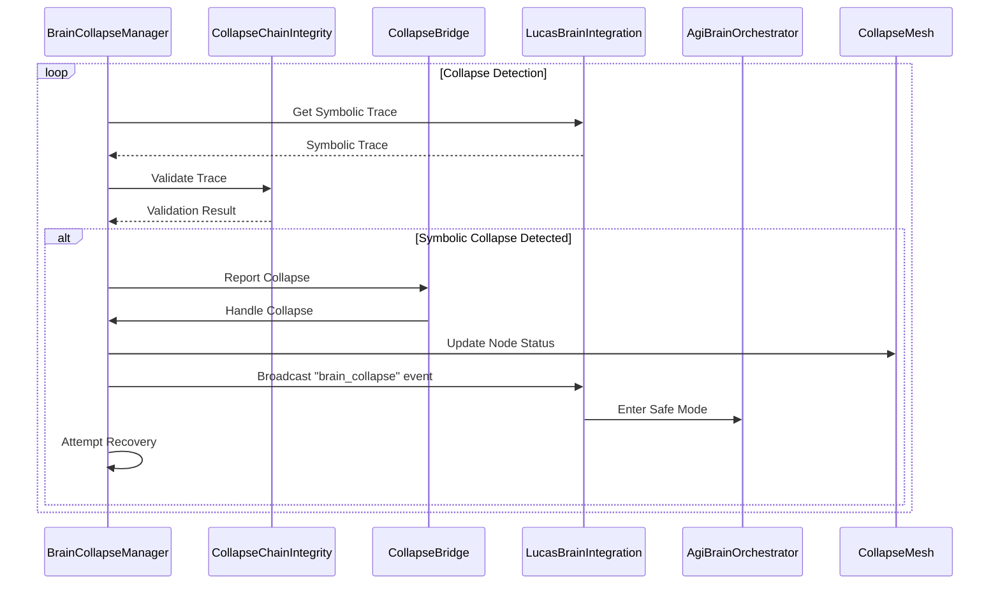

# Brain Module Trace

This document provides a symbolic narrative and drift map of the `brain` module.

## Symbolic Narrative

The `brain` module is the central cognitive hub of the LUKHAS AGI system. It is responsible for orchestrating the various components of the AGI, including memory, emotion, voice, and identity. The `brain` module is designed to be a self-adapting system that can learn and evolve over time.

The core of the `brain` module is the `AgiBrainOrchestrator`, which integrates three major systems: the `Crista Optimizer`, the `Meta-Learning System`, and the `Quantum Bio-Optimization System`. These systems work together to provide a comprehensive AI framework.

The `LucasBrainIntegration` class is another key component of the `brain` module. It connects the memory, emotion, voice, and identity systems into a unified cognitive architecture. It uses a `MemoryEmotionalIntegrator` to bridge the `AGIMemory` system with an emotional memory system. It also includes an `EmotionalOscillator` to manage the AGI's emotional state and a `MemoryVoiceIntegrator` to modulate the AGI's voice based on its emotional state.

## Drift Map

The `brain` module is designed to be a self-adapting system, which means that it is subject to drift. The following are some of the key drift points in the `brain` module:

*   **`AgiBrainOrchestrator`:** The `AgiBrainOrchestrator` is responsible for orchestrating the various components of the AGI. If the orchestrator's logic is flawed, it could lead to unpredictable behavior.
*   **`LucasBrainIntegration`:** The `LucasBrainIntegration` class is responsible for connecting the various components of the AGI. If the integration is not handled correctly, it could lead to a breakdown in communication between the components.
*   **`EmotionalOscillator`:** The `EmotionalOscillator` is responsible for managing the AGI's emotional state. If the oscillator's logic is flawed, it could lead to emotional instability.
*   **`MemoryEmotionalIntegrator`:** The `MemoryEmotionalIntegrator` is responsible for bridging the `AGIMemory` system with an emotional memory system. If the integration is not handled correctly, it could lead to a disconnect between the AGI's memories and its emotions.
*   **`MemoryVoiceIntegrator`:** The `MemoryVoiceIntegrator` is responsible for modulating the AGI's voice based on its emotional state. If the integration is not handled correctly, it could lead to a disconnect between the AGI's emotions and its voice.

## Collapse Flows

The following is a high-level overview of the collapse flows in the `brain` module:

1.  A symbolic collapse is detected by the `BrainCollapseManager`.
2.  The `BrainCollapseManager` broadcasts a "brain_collapse" event to all components.
3.  The `AgiBrainOrchestrator` and `LucasBrainIntegration` components enter a safe mode where only essential services are running.
4.  The `BrainCollapseManager` attempts to recover from the collapse.
5.  If the recovery is successful, the `AgiBrainOrchestrator` and `LucasBrainIntegration` components return to normal operation.
6.  If the recovery is unsuccessful, the `BrainCollapseManager` will continue to attempt to recover from the collapse at regular intervals.

## Collapse Detection Sequence Diagram

## Collapse Mesh

The collapse mesh is a network of symbolic nodes that represents the health of the LUKHAS brain. The mesh is used to detect and recover from symbolic collapses. Each node in the mesh represents a component of the brain, and the edges between the nodes represent the dependencies between the components.

The `CollapseMesh` class in `orchestration/brain/mesh/collapse_mesh.py` defines the structure of the collapse mesh. The `BrainCollapseManager` uses the `CollapseMesh` to monitor the health of the brain and to coordinate the recovery from a symbolic collapse.
